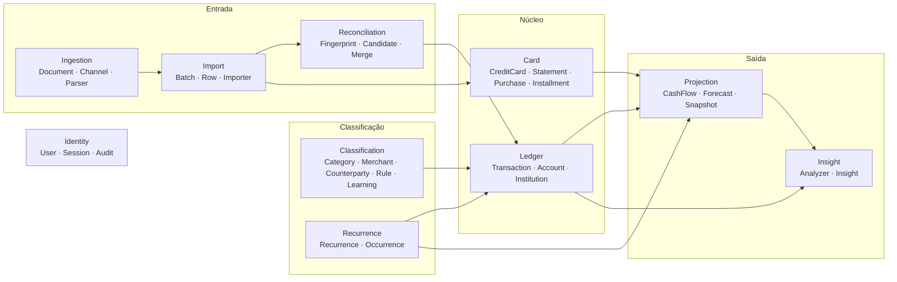
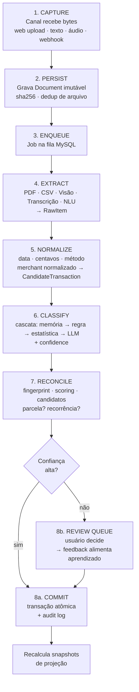
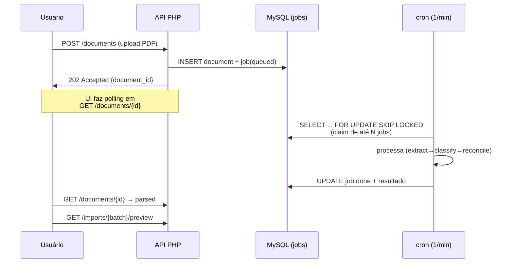

# 01 — Arquitetura do Sistema

## 1. Visão de 10.000 metros

O sistema é um **monólito modular API-first**. Existe um único deployable PHP que expõe:

1. uma **API JSON** (`/api/v1/*`) — toda a lógica de negócio;
2. um **shell HTML** que carrega uma SPA leve consumindo essa API;
3. **webhooks** de entrada (futuro WhatsApp);
4. um **CLI** (`bin/console`) chamado por cron para trabalho assíncrono.

```mermaid
graph TB
  subgraph Clientes
    B[Browser Desktop]
    M[Browser Mobile / PWA]
    W[WhatsApp (V3)]
  end

  subgraph "Hospedagem PHP compartilhada"
    subgraph "public/ (único dir exposto)"
      FC[index.php — Front Controller]
    end
    subgraph "src/ (fora do webroot)"
      HTTP[Camada HTTP<br/>Controllers · Middleware]
      APP[Camada de Aplicação<br/>Use Cases]
      DOM[Domínio<br/>Entidades · Regras · Interfaces]
      INF[Infraestrutura<br/>MySQL · Storage · IA · Fila]
    end
    CRON[cron/tick.php<br/>a cada 1 min]
    subgraph "storage/ (fora do webroot)"
      UP[uploads/]
      LOG[logs/]
      BK[backups/]
    end
    DB[(MySQL)]
  end

  subgraph "Serviços externos (opcionais e substituíveis)"
    AI[Provedor LLM]
    TR[Provedor de transcrição]
    OFF[Backup offsite]
  end

  B & M --> FC
  W --> FC
  FC --> HTTP --> APP --> DOM
  APP --> INF
  INF --> DB
  INF --> UP
  CRON --> APP
  INF -.-> AI
  INF -.-> TR
  BK -.-> OFF
```

## 2. Camadas e a regra de dependência

**A dependência aponta sempre para dentro.** O domínio não conhece ninguém.

```
Http ──► Application ──► Domain ◄── Infrastructure
                            ▲
                            └── define as interfaces que a Infra implementa
```

| Camada | Responsabilidade | Pode importar | **Nunca** pode importar |
|--------|------------------|---------------|--------------------------|
| **Domain** | Entidades, Value Objects, regras de negócio puras, interfaces de repositório e de serviços externos | Só `Support/` (Money, Clock) | PDO, HTTP, `Illuminate\*` (Laravel/Eloquent), cURL, `$_SESSION`, `date()` direto |
| **Application** | Use cases (1 classe = 1 operação), orquestração, transações, DTOs | Domain | `Illuminate\*`, PDO direto, `$_POST` |
| **Infrastructure** | Repositórios (Query Builder do Laravel ou PDO), clientes HTTP de IA, storage de arquivo, fila, e-mail, parsers de PDF/CSV | Domain, Application (DTOs) | Http |
| **Http** | Controllers Laravel, validação de entrada (Form Requests), serialização, middleware, autenticação | Application, DTOs | Domain diretamente (só via use case), PDO |

> **Laravel como infraestrutura, não como dono da regra (ADR-0005):** o framework vive em `Http/` e
> `Infrastructure/`. `Domain/` e `Application/` são PHP puro, sem `use Illuminate\...` — verificado por
> `tests/Architecture/DependencyRuleTest.php`. Persistência usa o Query Builder (`DB::table(...)`) nos
> repositórios; **Eloquent não é usado como entidade de domínio** e nenhum Model atravessa de volta
> para `Domain/`.

**Por que isso importa em 5 anos:** trocar hospedagem compartilhada por VPS, MySQL por Postgres, ou o provedor de IA não deve tocar em uma linha de regra de negócio. Já vi projetos financeiros morrerem porque a regra de "quando a parcela cai na fatura" estava dentro de um controller.

### Teste arquitetural automatizado

Um teste em `tests/Architecture/DependencyRuleTest.php` varre os `use` de cada arquivo e **falha o build** se a regra acima for violada. Isso não é burocracia: é o que impede a erosão em anos de manutenção.

## 3. Módulos de domínio (bounded contexts internos)

Cada módulo é uma pasta em `src/Domain/` com suas entidades, VOs, serviços de domínio e interfaces. Comunicação entre módulos acontece **na camada de Application** (use case orquestra), nunca por acoplamento direto de entidades.



| Módulo | Coração dele |
|--------|--------------|
| **Ledger** | O livro-caixa: fatos financeiros realizados. Fonte da verdade do passado. |
| **Card** | Cartão, faturas, compras e parcelas. Fonte da verdade do **futuro comprometido**. |
| **Ingestion** | Recebe bytes de qualquer canal e produz "candidatos a movimentação" normalizados. |
| **Import** | Ciclo preview→commit de um lote, com rollback. |
| **Reconciliation** | O guardião do princípio P1 (nunca duplicar). |
| **Classification** | Categoria, estabelecimento, favorecido, regras e o aprendizado. |
| **Recurrence** | Agrupador de pagamentos repetidos + histórico de reajustes. |
| **Projection** | Motor de fluxo de caixa futuro. O produto de verdade. |
| **Insight** | Analisadores que geram frases acionáveis. |
| **Identity** | Usuário, sessão, auditoria, permissões. |

## 4. O pipeline de ingestão — a espinha dorsal

**Todo** dado que entra no sistema — sem exceção, de qualquer canal — passa pelas mesmas 8 etapas. É isso que permite adicionar WhatsApp em V3 sem reescrever nada.



**Contratos-chave (interfaces do domínio):**

```
IngestionChannel  → recebe(payload) : Document
Extractor         → suporta(Document) : bool ; extrai(Document) : RawItem[]
Normalizer        → normaliza(RawItem) : CandidateTransaction
Classifier        → classifica(CandidateTransaction) : Classification{category, confidence, reason}
Reconciler        → analisa(CandidateTransaction) : Decision{create|merge|skip|ask, candidates[], score}
Committer         → aplica(Decision) : Transaction|null
```

Cada um é uma interface pequena com implementações plugáveis. Adicionar "importar OFX" = escrever um `Extractor`. Adicionar WhatsApp = escrever um `IngestionChannel`. **Nada mais muda.**

## 5. Processamento assíncrono sem daemon (ADR-0002)

Hospedagem compartilhada não permite worker permanente. A solução:



- **Claim atômico:** `UPDATE jobs SET status='running', locked_by=:token, locked_at=NOW() WHERE status='queued' AND available_at<=NOW() ORDER BY priority, id LIMIT :n` — funciona em MySQL e MariaDB sem `SKIP LOCKED`.
- **Sem cron?** Fallback: o próprio request faz um "kick" (fire-and-forget via `fastcgi_finish_request()`) processando 1 job após responder. Degrada, não quebra.
- **Retry:** backoff exponencial (`available_at = NOW() + 2^attempts min`), máximo 5 tentativas, depois `failed` + notificação na UI.
- **Watchdog:** jobs `running` há mais de 10 min voltam para `queued` (crash recovery).
- **Idempotência obrigatória:** todo job precisa poder rodar 2x sem duplicar efeito (I2 garante isso).

## 6. Modelo de leitura vs. escrita

Escrita é normalizada e auditada. Leitura de dashboard **não** faz agregação pesada em tempo real:

- `cashflow_snapshots` e `account_daily_balances` são **read models** materializados.
- Reconstruídos por cron (madrugada) e invalidados por evento (qualquer commit de transação marca `snapshot_dirty` do período afetado; o cron rebuilda só o sujo).
- Consequência: dashboard responde em ~1 query indexada, mesmo com 10 anos de histórico. Em hospedagem compartilhada isso é a diferença entre 80ms e 4s.

## 7. Cache e performance

| Alvo | Estratégia |
|------|-----------|
| Dashboards | Read models materializados (acima) |
| Respostas de IA | `ai_calls.input_hash` — mesmo input nunca é pago duas vezes |
| Classificação | Memória de merchant em tabela indexada; 0 chamadas de IA para estabelecimento conhecido |
| Assets | Hash no nome + `Cache-Control: immutable` |
| API | `ETag`/`If-None-Match` em listagens |
| PHP | OPcache ligado; sem autoload dev em produção (`composer dump-autoload -o`) |

## 8. Observabilidade num ambiente sem ferramentas

Não haverá Datadog. Então:

- **Log estruturado** JSON em `storage/logs/app-YYYY-MM-DD.log`, rotação 30 dias.
- **`request_id`** propagado em todo log e devolvido no header — permite reconstruir uma requisição inteira.
- **Tela interna `/admin/health`**: fila (queued/failed/idade do mais antigo), último cron, último backup, custo de IA no mês, taxa de auto-classificação, transações em revisão.
- **Alerta por e-mail** quando: job falhou definitivamente, backup falhou, cron não rodou em 30 min, custo de IA passou do teto mensal.
- **Métricas de produto** em tabela `metrics_daily`: % auto-classificado, nº de revisões manuais, precisão da projeção vs. realizado. É como saberemos se o princípio P2 está sendo cumprido.

## 9. Ambientes

| Ambiente | Onde | Banco | IA |
|----------|------|-------|-----|
| local | PHP embutido/Docker opcional | MySQL local | provider `fake` (respostas fixas) → testes determinísticos e grátis |
| staging (opcional) | subdomínio da mesma hospedagem | schema separado | provider real com teto de gasto baixo |
| produção | hospedagem compartilhada | schema principal | provider real |

Configuração por `.env` **fora do webroot**, lido uma vez no bootstrap. Nenhuma credencial no código ou no Git.

## 10. O que explicitamente NÃO faremos (e por quê)

| Não faremos | Motivo |
|-------------|--------|
| Open Finance / scraping bancário | Alto custo, exige certificação, quebra sempre. Os canais propostos (PDF/CSV/print/voz) já resolvem 100% do caso de uso. Reavaliar em V3. |
| Microserviços | Um usuário. Complexidade sem benefício. Monólito modular permite extrair depois se necessário. |
| Event sourcing completo | Overkill. O `audit_log` + `documents` imutáveis dão rastreabilidade suficiente. |
| ORM pesado (Doctrine/Eloquent) | Custo de performance e de acoplamento em shared hosting. Repositórios PDO explícitos com SQL legível envelhecem melhor. |
| Modelo de ML treinado localmente | PHP não é ambiente para isso. Naive Bayes incremental em SQL + LLM cobrem o caso com folga. |
| Multi-moeda ativa | Coluna existe, lógica de conversão fica para V3. Não pagar complexidade hoje. |
