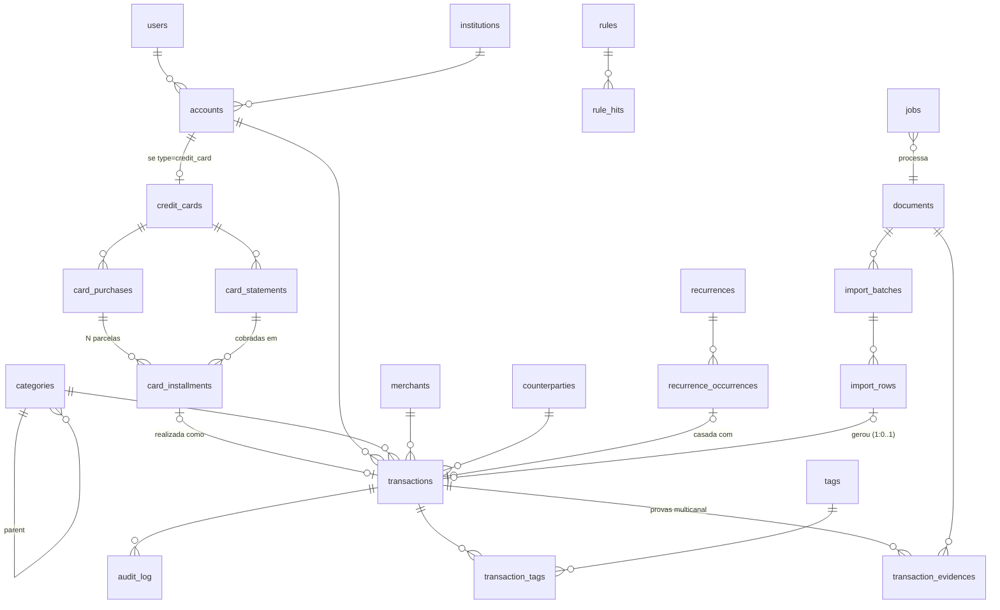
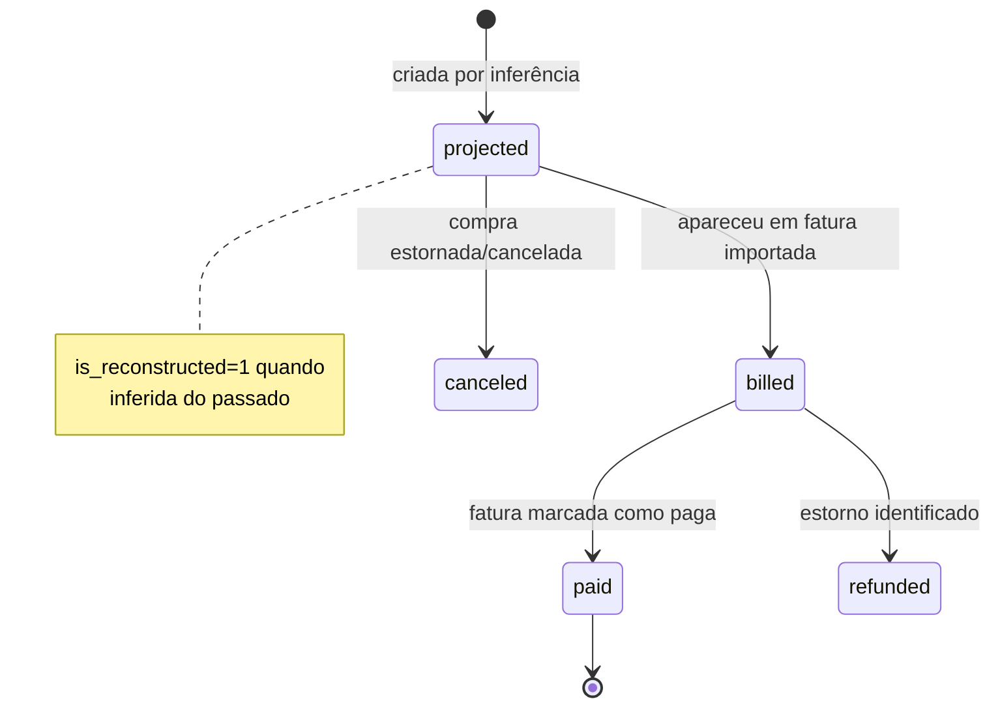

# 02 — Modelagem do Banco de Dados

**Baseline de compatibilidade:** MySQL 8.0+ ou MariaDB 10.4+. InnoDB, `utf8mb4_0900_ai_ci`
(ou `utf8mb4_unicode_ci` em MariaDB). Sem window functions, sem CTE, sem CHECK constraints
(portabilidade em hospedagem compartilhada). Colunas `JSON` (MariaDB trata como LONGTEXT — ok,
nunca indexamos dentro de JSON).

## Convenções obrigatórias

| Regra | Detalhe |
|-------|---------|
| Dinheiro | **Sempre** `BIGINT` em **centavos**. Nunca FLOAT/DOUBLE. Nunca DECIMAL. (ADR-0006) |
| Datas | `DATE` para o que é dia (competência); `DATETIME` UTC quando hora importa. Timezone do usuário aplicado na apresentação. |
| PK | `BIGINT UNSIGNED AUTO_INCREMENT` |
| Multi-tenant | `user_id` em **toda** tabela de dados (ADR-0008), primeira coluna de todo índice composto |
| Soft delete | `deleted_at DATETIME NULL` nas entidades que o usuário pode apagar (ADR-0013) |
| Timestamps | `created_at`, `updated_at` em tudo |
| Enums | `VARCHAR` + validação no domínio (ENUM do MySQL é doloroso de evoluir por 10 anos) |
| Nomes | tabelas plural snake_case; FK `<entidade>_id` |
| FKs | `ON DELETE RESTRICT` por padrão; `CASCADE` só em tabelas-filhas puras (tags, evidences) |

---

## 1. Mapa do modelo



---

## 2. DDL comentado

### 2.1 Identidade e auditoria

```sql
CREATE TABLE users (
  id              BIGINT UNSIGNED NOT NULL AUTO_INCREMENT,
  name            VARCHAR(120)    NOT NULL,
  email           VARCHAR(190)    NOT NULL,
  password_hash   VARCHAR(255)    NOT NULL,          -- Argon2id
  totp_secret     VARBINARY(255)  NULL,              -- cifrado com APP_KEY
  totp_enabled_at DATETIME        NULL,
  timezone        VARCHAR(64)     NOT NULL DEFAULT 'America/Sao_Paulo',
  locale          VARCHAR(10)     NOT NULL DEFAULT 'pt-BR',
  currency        CHAR(3)         NOT NULL DEFAULT 'BRL',
  is_active       TINYINT(1)      NOT NULL DEFAULT 1,
  last_login_at   DATETIME        NULL,
  created_at      DATETIME        NOT NULL,
  updated_at      DATETIME        NOT NULL,
  PRIMARY KEY (id),
  UNIQUE KEY uq_users_email (email)
) ENGINE=InnoDB;

-- Sessões server-side: permitem revogar tudo, ver dispositivos, expirar de verdade.
CREATE TABLE sessions (
  id            CHAR(64)        NOT NULL,            -- SHA-256 do token (token nunca é gravado)
  user_id       BIGINT UNSIGNED NOT NULL,
  ip            VARBINARY(16)   NULL,
  user_agent    VARCHAR(255)    NULL,
  device_label  VARCHAR(80)     NULL,
  is_trusted    TINYINT(1)      NOT NULL DEFAULT 0,  -- pulou 2FA neste device
  created_at    DATETIME        NOT NULL,
  last_seen_at  DATETIME        NOT NULL,
  expires_at    DATETIME        NOT NULL,
  revoked_at    DATETIME        NULL,
  PRIMARY KEY (id),
  KEY ix_sessions_user (user_id, expires_at),
  CONSTRAINT fk_sessions_user FOREIGN KEY (user_id) REFERENCES users(id) ON DELETE CASCADE
) ENGINE=InnoDB;

CREATE TABLE login_attempts (
  id          BIGINT UNSIGNED NOT NULL AUTO_INCREMENT,
  email       VARCHAR(190)    NOT NULL,
  ip          VARBINARY(16)   NULL,
  successful  TINYINT(1)      NOT NULL,
  created_at  DATETIME        NOT NULL,
  PRIMARY KEY (id),
  KEY ix_attempts_email_time (email, created_at),
  KEY ix_attempts_ip_time (ip, created_at)
) ENGINE=InnoDB;

-- Trilha imutável. Só INSERT. Nunca UPDATE/DELETE. (Invariante I7)
CREATE TABLE audit_log (
  id           BIGINT UNSIGNED NOT NULL AUTO_INCREMENT,
  user_id      BIGINT UNSIGNED NOT NULL,
  entity_type  VARCHAR(60)     NOT NULL,   -- 'transaction','recurrence','rule','category',...
  entity_id    BIGINT UNSIGNED NULL,
  action       VARCHAR(40)     NOT NULL,   -- created|updated|deleted|restored|merged|categorized|...
  changes      JSON            NULL,       -- {"campo":{"from":x,"to":y}}
  actor        VARCHAR(20)     NOT NULL,   -- user|system|ai|import|rule
  source       VARCHAR(20)     NULL,       -- manual|pdf|csv|ocr|text|audio|whatsapp
  request_id   CHAR(26)        NULL,
  ip           VARBINARY(16)   NULL,
  created_at   DATETIME(3)     NOT NULL,
  PRIMARY KEY (id),
  KEY ix_audit_entity (user_id, entity_type, entity_id, id),
  KEY ix_audit_time (user_id, created_at)
) ENGINE=InnoDB;

CREATE TABLE user_settings (
  user_id     BIGINT UNSIGNED NOT NULL,
  skey        VARCHAR(80)     NOT NULL,
  svalue      JSON            NOT NULL,
  updated_at  DATETIME        NOT NULL,
  PRIMARY KEY (user_id, skey)
) ENGINE=InnoDB;
```

### 2.2 Instituições, contas e cartões

```sql
CREATE TABLE institutions (
  id          BIGINT UNSIGNED NOT NULL AUTO_INCREMENT,
  user_id     BIGINT UNSIGNED NOT NULL,
  name        VARCHAR(120)    NOT NULL,      -- 'Nubank','Itaú','Banco do Brasil'
  kind        VARCHAR(20)     NOT NULL,      -- bank|card_issuer|broker|wallet|other
  ispb        CHAR(8)         NULL,          -- código do BC, útil para casar PIX
  color       CHAR(7)         NULL,
  logo_path   VARCHAR(255)    NULL,
  created_at  DATETIME        NOT NULL,
  updated_at  DATETIME        NOT NULL,
  PRIMARY KEY (id),
  UNIQUE KEY uq_inst_user_name (user_id, name)
) ENGINE=InnoDB;

CREATE TABLE accounts (
  id                     BIGINT UNSIGNED NOT NULL AUTO_INCREMENT,
  user_id                BIGINT UNSIGNED NOT NULL,
  institution_id         BIGINT UNSIGNED NULL,
  name                   VARCHAR(120)    NOT NULL,     -- 'Itaú Corrente','Carteira','Nubank Cartão'
  type                   VARCHAR(20)     NOT NULL,     -- checking|savings|cash|investment|credit_card|voucher
  currency               CHAR(3)         NOT NULL DEFAULT 'BRL',
  opening_balance_cents  BIGINT          NOT NULL DEFAULT 0,
  opening_balance_date   DATE            NOT NULL,
  include_in_networth    TINYINT(1)      NOT NULL DEFAULT 1,
  include_in_cashflow    TINYINT(1)      NOT NULL DEFAULT 1,
  color                  CHAR(7)         NULL,
  sort_order             SMALLINT        NOT NULL DEFAULT 0,
  archived_at            DATETIME        NULL,
  created_at             DATETIME        NOT NULL,
  updated_at             DATETIME        NOT NULL,
  PRIMARY KEY (id),
  KEY ix_accounts_user (user_id, archived_at),
  CONSTRAINT fk_accounts_inst FOREIGN KEY (institution_id) REFERENCES institutions(id)
) ENGINE=InnoDB;

-- Cartão = extensão 1:1 de uma account do tipo credit_card.
CREATE TABLE credit_cards (
  id                  BIGINT UNSIGNED NOT NULL AUTO_INCREMENT,
  user_id             BIGINT UNSIGNED NOT NULL,
  account_id          BIGINT UNSIGNED NOT NULL,
  payment_account_id  BIGINT UNSIGNED NULL,      -- conta que paga a fatura (para o fluxo de caixa)
  brand               VARCHAR(20)     NULL,      -- visa|mastercard|elo|amex|hipercard
  last4               CHAR(4)         NULL,
  holder_name         VARCHAR(120)    NULL,
  credit_limit_cents  BIGINT          NULL,
  closing_day         TINYINT         NULL,      -- dia do fechamento (1-31)
  due_day             TINYINT         NOT NULL,  -- dia do vencimento (1-31)
  due_day_rule        VARCHAR(20)     NOT NULL DEFAULT 'next_business_day', -- exact|next_business_day|prev_business_day
  is_virtual          TINYINT(1)      NOT NULL DEFAULT 0,
  created_at          DATETIME        NOT NULL,
  updated_at          DATETIME        NOT NULL,
  PRIMARY KEY (id),
  UNIQUE KEY uq_card_account (account_id),
  CONSTRAINT fk_card_account FOREIGN KEY (account_id) REFERENCES accounts(id)
) ENGINE=InnoDB;

-- Uma fatura por (cartão, mês de referência). É o "contêiner" das parcelas.
CREATE TABLE card_statements (
  id                     BIGINT UNSIGNED NOT NULL AUTO_INCREMENT,
  user_id                BIGINT UNSIGNED NOT NULL,
  credit_card_id         BIGINT UNSIGNED NOT NULL,
  reference_month        DATE            NOT NULL,   -- sempre dia 01 do mês de referência
  opening_date           DATE            NULL,
  closing_date           DATE            NULL,
  due_date               DATE            NOT NULL,
  previous_balance_cents BIGINT          NOT NULL DEFAULT 0,
  purchases_cents        BIGINT          NOT NULL DEFAULT 0,
  payments_cents         BIGINT          NOT NULL DEFAULT 0,
  interest_cents         BIGINT          NOT NULL DEFAULT 0,
  fees_cents             BIGINT          NOT NULL DEFAULT 0,
  total_cents            BIGINT          NOT NULL DEFAULT 0,
  minimum_cents          BIGINT          NULL,
  status                 VARCHAR(20)     NOT NULL,   -- projected|open|closed|paid|partially_paid|overdue
  source_document_id     BIGINT UNSIGNED NULL,       -- PDF de origem
  items_sum_cents        BIGINT          NULL,       -- soma do que conseguimos extrair
  reconciled             TINYINT(1)      NOT NULL DEFAULT 0,  -- items_sum == total?
  imported_at            DATETIME        NULL,
  created_at             DATETIME        NOT NULL,
  updated_at             DATETIME        NOT NULL,
  PRIMARY KEY (id),
  UNIQUE KEY uq_stmt_card_month (credit_card_id, reference_month),
  KEY ix_stmt_due (user_id, due_date)
) ENGINE=InnoDB;
```

### 2.3 O coração: compras parceladas e parcelas (ADR-0004)

> Esta é a estrutura que resolve o objetivo nº 1 do produto. Uma compra parcelada é
> uma **obrigação** que existe independentemente de já ter sido cobrada. Ela gera N
> parcelas, cada uma com um mês de referência. Importar a fatura do mês 5 **reconstrói
> as 4 passadas e projeta as 7 futuras**.

```sql
CREATE TABLE card_purchases (
  id                      BIGINT UNSIGNED NOT NULL AUTO_INCREMENT,
  user_id                 BIGINT UNSIGNED NOT NULL,
  credit_card_id          BIGINT UNSIGNED NOT NULL,
  merchant_id             BIGINT UNSIGNED NULL,
  category_id             BIGINT UNSIGNED NULL,
  description             VARCHAR(255)    NOT NULL,   -- 'Notebook Dell'
  raw_description         VARCHAR(500)    NULL,       -- texto cru da fatura
  purchase_date           DATE            NULL,       -- data da compra (quando a fatura informa)
  installments_total      SMALLINT        NOT NULL DEFAULT 1,
  installment_amount_cents BIGINT         NOT NULL,
  total_amount_cents      BIGINT          NOT NULL,   -- = parcela * total (+ ajuste de centavos)
  first_reference_month   DATE            NOT NULL,   -- mês de referência da parcela 1 (dia 01)
  currency                CHAR(3)         NOT NULL DEFAULT 'BRL',
  original_amount         DECIMAL(18,6)   NULL,       -- compra internacional
  original_currency       CHAR(3)         NULL,
  status                  VARCHAR(20)     NOT NULL,   -- active|completed|canceled|refunded|disputed
  is_installment_plan     TINYINT(1)      NOT NULL DEFAULT 0, -- parcelamento de fatura (não compra)
  group_key               CHAR(64)        NOT NULL,   -- ⭐ chave de reconhecimento entre faturas
  detection_confidence    DECIMAL(4,3)    NOT NULL DEFAULT 1.000,
  needs_review            TINYINT(1)      NOT NULL DEFAULT 0,
  source                  VARCHAR(20)     NOT NULL,   -- pdf|csv|manual|ocr|text
  source_document_id      BIGINT UNSIGNED NULL,
  notes                   TEXT            NULL,
  created_at              DATETIME        NOT NULL,
  updated_at              DATETIME        NOT NULL,
  deleted_at              DATETIME        NULL,
  PRIMARY KEY (id),
  UNIQUE KEY uq_purchase_group (user_id, credit_card_id, group_key),  -- ⭐ Invariante I10
  KEY ix_purchase_status (user_id, status, first_reference_month),
  KEY ix_purchase_merchant (user_id, merchant_id)
) ENGINE=InnoDB;
```

**`group_key`** = `sha256( credit_card_id | merchant_normalized | installment_amount_cents | installments_total | first_reference_month )`

`first_reference_month` é **derivado**: `reference_month_da_fatura - (numero_da_parcela - 1) meses`.
É isso que faz a parcela "5/12" de agosto e a "6/12" de setembro resolverem para a **mesma compra**,
sem nenhuma intervenção do usuário. Sem essa coluna derivada, não existe reconhecimento entre faturas.

```sql
CREATE TABLE card_installments (
  id               BIGINT UNSIGNED NOT NULL AUTO_INCREMENT,
  user_id          BIGINT UNSIGNED NOT NULL,
  purchase_id      BIGINT UNSIGNED NOT NULL,
  credit_card_id   BIGINT UNSIGNED NOT NULL,   -- desnormalizado: 90% das queries filtram por cartão
  number           SMALLINT        NOT NULL,   -- 5
  installments_total SMALLINT      NOT NULL,   -- 12  (desnormalizado p/ exibir "5/12")
  amount_cents     BIGINT          NOT NULL,
  reference_month  DATE            NOT NULL,   -- mês da fatura em que cai (dia 01)
  due_date         DATE            NULL,       -- vencimento previsto/real da fatura
  statement_id     BIGINT UNSIGNED NULL,       -- preenchido quando aparece numa fatura importada
  transaction_id   BIGINT UNSIGNED NULL,       -- se materializada no ledger
  status           VARCHAR(20)     NOT NULL,   -- projected|billed|paid|canceled|refunded
  is_reconstructed TINYINT(1)      NOT NULL DEFAULT 0, -- inferida, não vista em fatura
  created_at       DATETIME        NOT NULL,
  updated_at       DATETIME        NOT NULL,
  PRIMARY KEY (id),
  UNIQUE KEY uq_inst_purchase_number (purchase_id, number),   -- Invariante
  KEY ix_inst_forecast (user_id, credit_card_id, reference_month, status),  -- ⭐ query da projeção
  KEY ix_inst_statement (statement_id),
  CONSTRAINT fk_inst_purchase FOREIGN KEY (purchase_id) REFERENCES card_purchases(id) ON DELETE CASCADE
) ENGINE=InnoDB;
```

**Estados de uma parcela:**



### 2.4 Categorias, estabelecimentos, pessoas, tags

```sql
CREATE TABLE categories (
  id           BIGINT UNSIGNED NOT NULL AUTO_INCREMENT,
  user_id      BIGINT UNSIGNED NOT NULL,
  parent_id    BIGINT UNSIGNED NULL,        -- 2 níveis: categoria > subcategoria
  name         VARCHAR(80)     NOT NULL,
  slug         VARCHAR(80)     NOT NULL,
  kind         VARCHAR(20)     NOT NULL,    -- expense|income|transfer|investment
  color        CHAR(7)         NULL,
  icon         VARCHAR(40)     NULL,
  is_system    TINYINT(1)      NOT NULL DEFAULT 0,  -- do seed; não pode ser deletada, só arquivada
  is_essential TINYINT(1)      NOT NULL DEFAULT 0,  -- gasto fixo x supérfluo (análises)
  sort_order   SMALLINT        NOT NULL DEFAULT 0,
  archived_at  DATETIME        NULL,
  created_at   DATETIME        NOT NULL,
  updated_at   DATETIME        NOT NULL,
  PRIMARY KEY (id),
  UNIQUE KEY uq_cat_user_slug (user_id, parent_id, slug),
  KEY ix_cat_parent (user_id, parent_id)
) ENGINE=InnoDB;

-- Estabelecimento canônico. A "memória" do sistema sobre onde você gasta.
CREATE TABLE merchants (
  id                  BIGINT UNSIGNED NOT NULL AUTO_INCREMENT,
  user_id             BIGINT UNSIGNED NOT NULL,
  canonical_name      VARCHAR(160)    NOT NULL,   -- 'Shell'
  normalized_key      VARCHAR(160)    NOT NULL,   -- 'shell'  (sem acento/dígito/ruído)
  default_category_id BIGINT UNSIGNED NULL,
  cnpj                VARCHAR(14)     NULL,
  city                VARCHAR(80)     NULL,
  is_online           TINYINT(1)      NOT NULL DEFAULT 0,
  times_seen          INT UNSIGNED    NOT NULL DEFAULT 0,
  first_seen_on       DATE            NULL,
  last_seen_on        DATE            NULL,
  total_spent_cents   BIGINT          NOT NULL DEFAULT 0,
  created_at          DATETIME        NOT NULL,
  updated_at          DATETIME        NOT NULL,
  PRIMARY KEY (id),
  UNIQUE KEY uq_merchant_key (user_id, normalized_key),
  KEY ix_merchant_seen (user_id, last_seen_on)
) ENGINE=InnoDB;

-- Aliases: 'SHELL BOX 4412', 'AUTO POSTO SHELL' → mesmo merchant.
CREATE TABLE merchant_aliases (
  id           BIGINT UNSIGNED NOT NULL AUTO_INCREMENT,
  user_id      BIGINT UNSIGNED NOT NULL,
  merchant_id  BIGINT UNSIGNED NOT NULL,
  alias_key    VARCHAR(190)    NOT NULL,
  origin       VARCHAR(20)     NOT NULL,   -- learned|manual|seed
  times_seen   INT UNSIGNED    NOT NULL DEFAULT 1,
  created_at   DATETIME        NOT NULL,
  PRIMARY KEY (id),
  UNIQUE KEY uq_alias (user_id, alias_key),
  CONSTRAINT fk_alias_merchant FOREIGN KEY (merchant_id) REFERENCES merchants(id) ON DELETE CASCADE
) ENGINE=InnoDB;

CREATE TABLE counterparties (
  id                  BIGINT UNSIGNED NOT NULL AUTO_INCREMENT,
  user_id             BIGINT UNSIGNED NOT NULL,
  name                VARCHAR(160)    NOT NULL,   -- 'João Silva'
  normalized_key      VARCHAR(160)    NOT NULL,
  kind                VARCHAR(20)     NOT NULL,   -- person|company|self
  document_masked      VARCHAR(20)    NULL,       -- '***.456.789-**' (nunca CPF completo)
  document_hash       CHAR(64)        NULL,       -- para casar sem armazenar o dado
  pix_keys            JSON            NULL,
  default_category_id BIGINT UNSIGNED NULL,
  relationship        VARCHAR(40)     NULL,       -- família|amigo|trabalho|fornecedor
  times_seen          INT UNSIGNED    NOT NULL DEFAULT 0,
  created_at          DATETIME        NOT NULL,
  updated_at          DATETIME        NOT NULL,
  PRIMARY KEY (id),
  UNIQUE KEY uq_cp_key (user_id, normalized_key)
) ENGINE=InnoDB;

CREATE TABLE tags (
  id         BIGINT UNSIGNED NOT NULL AUTO_INCREMENT,
  user_id    BIGINT UNSIGNED NOT NULL,
  name       VARCHAR(60)     NOT NULL,
  slug       VARCHAR(60)     NOT NULL,
  color      CHAR(7)         NULL,
  created_at DATETIME        NOT NULL,
  PRIMARY KEY (id),
  UNIQUE KEY uq_tag (user_id, slug)
) ENGINE=InnoDB;

CREATE TABLE transaction_tags (
  transaction_id BIGINT UNSIGNED NOT NULL,
  tag_id         BIGINT UNSIGNED NOT NULL,
  PRIMARY KEY (transaction_id, tag_id),
  KEY ix_tt_tag (tag_id),
  CONSTRAINT fk_tt_tx FOREIGN KEY (transaction_id) REFERENCES transactions(id) ON DELETE CASCADE,
  CONSTRAINT fk_tt_tag FOREIGN KEY (tag_id) REFERENCES tags(id) ON DELETE CASCADE
) ENGINE=InnoDB;
```

### 2.5 A tabela central: `transactions`

```sql
CREATE TABLE transactions (
  id                BIGINT UNSIGNED NOT NULL AUTO_INCREMENT,
  user_id           BIGINT UNSIGNED NOT NULL,

  -- Onde
  account_id        BIGINT UNSIGNED NOT NULL,
  credit_card_id    BIGINT UNSIGNED NULL,
  statement_id      BIGINT UNSIGNED NULL,

  -- Quanto
  direction         VARCHAR(3)      NOT NULL,   -- in|out
  amount_cents      BIGINT          NOT NULL,   -- sempre positivo; o sinal é o direction
  currency          CHAR(3)         NOT NULL DEFAULT 'BRL',

  -- Quando (dois eixos — ADR-0007)
  occurred_on       DATE            NOT NULL,   -- competência: quando o fato aconteceu
  occurred_at       DATETIME        NULL,       -- hora, quando o print/notificação informa
  cash_effect_on    DATE            NOT NULL,   -- caixa: quando o dinheiro sai/entra da conta

  -- O quê
  description       VARCHAR(255)    NOT NULL,   -- limpo, exibível
  raw_description   VARCHAR(500)    NULL,       -- cru da origem (nunca sobrescrever)
  category_id       BIGINT UNSIGNED NULL,
  merchant_id       BIGINT UNSIGNED NULL,
  counterparty_id   BIGINT UNSIGNED NULL,
  payment_method    VARCHAR(20)     NOT NULL,   -- pix|credit_card|debit_card|cash|boleto|ted|doc|transfer|direct_debit|other

  -- Estado
  status            VARCHAR(20)     NOT NULL,   -- pending|cleared|canceled|refunded
  is_transfer       TINYINT(1)      NOT NULL DEFAULT 0,
  transfer_group_id CHAR(26)        NULL,       -- une as 2 pernas de uma transferência / pgto de fatura
  excluded_from_analytics TINYINT(1) NOT NULL DEFAULT 0,  -- transferências, estornos

  -- Vínculos de inteligência
  installment_id    BIGINT UNSIGNED NULL,
  purchase_id       BIGINT UNSIGNED NULL,
  recurrence_id     BIGINT UNSIGNED NULL,
  occurrence_id     BIGINT UNSIGNED NULL,

  -- Procedência e confiança
  source            VARCHAR(20)     NOT NULL,   -- manual|pdf|csv|ocr|text|audio|whatsapp|api
  source_document_id BIGINT UNSIGNED NULL,
  import_row_id     BIGINT UNSIGNED NULL,
  external_id       VARCHAR(190)    NULL,       -- id do banco/instituição, quando existir
  category_confidence DECIMAL(4,3)  NULL,
  category_source   VARCHAR(20)     NULL,       -- user|rule|memory|stats|ai|seed
  needs_review      TINYINT(1)      NOT NULL DEFAULT 0,
  review_reason     VARCHAR(60)     NULL,       -- low_confidence|possible_duplicate|parse_mismatch

  -- Dedup
  fingerprint       CHAR(64)        NOT NULL,   -- estrito
  fingerprint_loose CHAR(64)        NOT NULL,   -- tolerante (data ±3d, valor exato)

  notes             TEXT            NULL,
  created_at        DATETIME        NOT NULL,
  updated_at        DATETIME        NOT NULL,
  deleted_at        DATETIME        NULL,

  PRIMARY KEY (id),
  UNIQUE KEY uq_tx_external (user_id, account_id, external_id),   -- Invariante I1 (NULLs não colidem)
  UNIQUE KEY uq_tx_import_row (import_row_id),                    -- Invariante I2
  KEY ix_tx_period      (user_id, occurred_on, id),
  KEY ix_tx_cash        (user_id, cash_effect_on, status),         -- ⭐ fluxo de caixa
  KEY ix_tx_cat         (user_id, category_id, occurred_on),
  KEY ix_tx_account     (user_id, account_id, occurred_on),
  KEY ix_tx_merchant    (user_id, merchant_id, occurred_on),
  KEY ix_tx_fp          (user_id, fingerprint),                    -- ⭐ dedup
  KEY ix_tx_fp_loose    (user_id, fingerprint_loose, amount_cents),
  KEY ix_tx_review      (user_id, needs_review, occurred_on),
  KEY ix_tx_recurrence  (user_id, recurrence_id, occurred_on),
  KEY ix_tx_statement   (statement_id),
  KEY ix_tx_deleted     (user_id, deleted_at)
) ENGINE=InnoDB;
```

**Decisões embutidas aqui e o motivo:**

- **`amount_cents` sempre positivo + `direction`** — evita a classe inteira de bugs "esqueci o `ABS()`" e torna `SUM` por direção trivial e legível.
- **`raw_description` imutável** — quando um parser melhorar em 2027, podemos reprocessar 5 anos de histórico. Sem o texto cru, não há reprocessamento possível. Esta coluna é o que dá ao sistema a capacidade de ficar mais inteligente **retroativamente**.
- **`cash_effect_on` materializado** — o fluxo de caixa é a query mais crítica do produto; ela não pode depender de `JOIN` com faturas para saber quando o dinheiro sai.
- **Dois fingerprints** — o estrito pega duplicata óbvia; o frouxo alimenta o scoring de "muito parecida" (a pergunta ao usuário).
- **`excluded_from_analytics`** — sem isso, transferência entre contas próprias polui todo dashboard. Erro clássico de app financeiro.
- **Sem UNIQUE em `fingerprint`** — dois cafés de R$ 7 no mesmo dia são legítimos. Duplicidade é decidida por scoring + usuário, nunca por constraint cega.

### 2.6 Recorrências (ADR-0010 — agrupador, não gerador)

```sql
CREATE TABLE recurrences (
  id                   BIGINT UNSIGNED NOT NULL AUTO_INCREMENT,
  user_id              BIGINT UNSIGNED NOT NULL,
  name                 VARCHAR(140)    NOT NULL,   -- 'Internet Vivo'
  kind                 VARCHAR(30)     NOT NULL,   -- subscription|bill|installment_plan|salary|rent|tuition|other
  direction            VARCHAR(3)      NOT NULL,   -- in|out
  frequency            VARCHAR(20)     NOT NULL,   -- weekly|biweekly|monthly|bimonthly|quarterly|semiannual|annual|custom
  interval_count       SMALLINT        NOT NULL DEFAULT 1,
  day_of_month         TINYINT         NULL,
  day_of_week          TINYINT         NULL,
  custom_rule          JSON            NULL,       -- para 'custom'
  expected_amount_cents BIGINT         NULL,
  amount_tolerance_pct  DECIMAL(5,2)   NOT NULL DEFAULT 15.00,
  date_tolerance_days   TINYINT        NOT NULL DEFAULT 5,
  category_id          BIGINT UNSIGNED NULL,
  merchant_id          BIGINT UNSIGNED NULL,
  counterparty_id      BIGINT UNSIGNED NULL,
  account_id           BIGINT UNSIGNED NULL,
  credit_card_id       BIGINT UNSIGNED NULL,
  payment_method       VARCHAR(20)     NULL,
  match_config         JSON            NULL,       -- {description_contains:[], regex:'', require_amount:false}
  started_on           DATE            NOT NULL,
  ended_on             DATE            NULL,
  status               VARCHAR(20)     NOT NULL,   -- active|paused|canceled|ended
  cancel_reason        VARCHAR(255)    NULL,
  is_essential         TINYINT(1)      NOT NULL DEFAULT 0,
  notes                TEXT            NULL,
  created_from         VARCHAR(20)     NOT NULL,   -- manual|suggestion
  created_at           DATETIME        NOT NULL,
  updated_at           DATETIME        NOT NULL,
  deleted_at           DATETIME        NULL,
  PRIMARY KEY (id),
  KEY ix_rec_status (user_id, status, frequency)
) ENGINE=InnoDB;

-- Uma linha por período esperado. Criada pelo motor de recorrência (nunca virá transação daqui).
CREATE TABLE recurrence_occurrences (
  id              BIGINT UNSIGNED NOT NULL AUTO_INCREMENT,
  user_id         BIGINT UNSIGNED NOT NULL,
  recurrence_id   BIGINT UNSIGNED NOT NULL,
  period_key      CHAR(10)        NOT NULL,   -- '2026-08' | '2026-W32'
  expected_on     DATE            NOT NULL,
  expected_amount_cents BIGINT    NULL,
  transaction_id  BIGINT UNSIGNED NULL,
  actual_amount_cents BIGINT      NULL,
  actual_on       DATE            NULL,
  status          VARCHAR(20)     NOT NULL,   -- expected|matched|late|missed|skipped
  match_confidence DECIMAL(4,3)   NULL,
  delta_pct       DECIMAL(7,2)    NULL,
  matched_at      DATETIME        NULL,
  created_at      DATETIME        NOT NULL,
  updated_at      DATETIME        NOT NULL,
  PRIMARY KEY (id),
  UNIQUE KEY uq_occ_period (recurrence_id, period_key),
  UNIQUE KEY uq_occ_tx (transaction_id),          -- 1 transação casa com no máx. 1 ocorrência
  KEY ix_occ_status (user_id, status, expected_on)
) ENGINE=InnoDB;

-- Histórico de reajustes — derivado, mas materializado para exibição instantânea.
CREATE TABLE recurrence_price_changes (
  id            BIGINT UNSIGNED NOT NULL AUTO_INCREMENT,
  user_id       BIGINT UNSIGNED NOT NULL,
  recurrence_id BIGINT UNSIGNED NOT NULL,
  changed_on    DATE            NOT NULL,
  from_cents    BIGINT          NOT NULL,
  to_cents      BIGINT          NOT NULL,
  delta_pct     DECIMAL(7,2)    NOT NULL,
  transaction_id BIGINT UNSIGNED NULL,
  created_at    DATETIME        NOT NULL,
  PRIMARY KEY (id),
  KEY ix_rpc (user_id, recurrence_id, changed_on)
) ENGINE=InnoDB;

-- Padrões detectados que ainda não são recorrência. O sistema sugere, o usuário decide.
CREATE TABLE recurrence_suggestions (
  id              BIGINT UNSIGNED NOT NULL AUTO_INCREMENT,
  user_id         BIGINT UNSIGNED NOT NULL,
  signature       CHAR(64)        NOT NULL,   -- hash do padrão detectado
  proposed        JSON            NOT NULL,   -- rascunho da recorrência
  evidence_tx_ids JSON            NOT NULL,   -- transações que sustentam o padrão
  occurrences     SMALLINT        NOT NULL,
  confidence      DECIMAL(4,3)    NOT NULL,
  status          VARCHAR(20)     NOT NULL,   -- pending|accepted|dismissed|expired
  recurrence_id   BIGINT UNSIGNED NULL,
  created_at      DATETIME        NOT NULL,
  decided_at      DATETIME        NULL,
  PRIMARY KEY (id),
  UNIQUE KEY uq_recsug (user_id, signature),
  KEY ix_recsug_status (user_id, status)
) ENGINE=InnoDB;
```

### 2.7 Regras e aprendizado

```sql
CREATE TABLE rules (
  id             BIGINT UNSIGNED NOT NULL AUTO_INCREMENT,
  user_id        BIGINT UNSIGNED NOT NULL,
  name           VARCHAR(140)    NOT NULL,
  priority       INT             NOT NULL DEFAULT 100,   -- menor = avaliada antes
  is_active      TINYINT(1)      NOT NULL DEFAULT 1,
  stop_on_match  TINYINT(1)      NOT NULL DEFAULT 1,
  conditions     JSON            NOT NULL,   -- ver formato abaixo
  actions        JSON            NOT NULL,
  applies_to     VARCHAR(20)     NOT NULL DEFAULT 'all', -- all|in|out
  match_count    INT UNSIGNED    NOT NULL DEFAULT 0,
  last_matched_at DATETIME       NULL,
  created_from   VARCHAR(20)     NOT NULL,   -- manual|suggestion|seed
  created_at     DATETIME        NOT NULL,
  updated_at     DATETIME        NOT NULL,
  deleted_at     DATETIME        NULL,
  PRIMARY KEY (id),
  KEY ix_rules_eval (user_id, is_active, priority)
) ENGINE=InnoDB;
```

```jsonc
// conditions — AND de grupos, OR dentro do grupo
{
  "all": [
    { "field": "raw_description", "op": "contains_ci", "value": "shell" },
    { "field": "amount_cents",    "op": "between",     "value": [1000, 50000] },
    { "field": "payment_method",  "op": "in",          "value": ["credit_card","debit_card"] }
  ],
  "any": [
    { "field": "counterparty_name", "op": "equals_ci", "value": "joão silva" }
  ]
}
// actions
{
  "set_category_id": 42,
  "set_merchant_id": 7,
  "add_tags": ["carro"],
  "set_recurrence_id": null,
  "set_needs_review": false,
  "exclude_from_analytics": false
}
```
Operadores suportados: `equals`, `equals_ci`, `contains_ci`, `starts_with_ci`, `regex`, `in`, `between`, `gt`, `lt`, `is_null`, `not`.

```sql
CREATE TABLE rule_hits (
  id             BIGINT UNSIGNED NOT NULL AUTO_INCREMENT,
  user_id        BIGINT UNSIGNED NOT NULL,
  rule_id        BIGINT UNSIGNED NOT NULL,
  transaction_id BIGINT UNSIGNED NOT NULL,
  created_at     DATETIME        NOT NULL,
  PRIMARY KEY (id),
  KEY ix_hits (user_id, rule_id, created_at)
) ENGINE=InnoDB;

CREATE TABLE rule_suggestions (
  id             BIGINT UNSIGNED NOT NULL AUTO_INCREMENT,
  user_id        BIGINT UNSIGNED NOT NULL,
  signature      CHAR(64)        NOT NULL,
  proposed_conditions JSON       NOT NULL,
  proposed_actions    JSON       NOT NULL,
  human_summary  VARCHAR(255)    NOT NULL,   -- "Toda compra na Shell → Combustível"
  evidence_count SMALLINT        NOT NULL,
  evidence_tx_ids JSON           NOT NULL,
  confidence     DECIMAL(4,3)    NOT NULL,
  status         VARCHAR(20)     NOT NULL,   -- pending|accepted|dismissed|expired
  rule_id        BIGINT UNSIGNED NULL,
  created_at     DATETIME        NOT NULL,
  decided_at     DATETIME        NULL,
  PRIMARY KEY (id),
  UNIQUE KEY uq_rulesug (user_id, signature),
  KEY ix_rulesug_status (user_id, status)
) ENGINE=InnoDB;

-- Sinal de treino: toda correção manual de categoria.
CREATE TABLE category_feedback (
  id              BIGINT UNSIGNED NOT NULL AUTO_INCREMENT,
  user_id         BIGINT UNSIGNED NOT NULL,
  transaction_id  BIGINT UNSIGNED NOT NULL,
  from_category_id BIGINT UNSIGNED NULL,
  to_category_id  BIGINT UNSIGNED NOT NULL,
  predicted_by    VARCHAR(20)     NULL,      -- quem errou: memory|stats|ai|rule
  predicted_confidence DECIMAL(4,3) NULL,
  merchant_key    VARCHAR(160)    NULL,
  tokens          JSON            NULL,      -- tokens usados pelo classificador estatístico
  created_at      DATETIME        NOT NULL,
  PRIMARY KEY (id),
  KEY ix_feedback (user_id, merchant_key, created_at)
) ENGINE=InnoDB;

-- Classificador estatístico incremental (Naive Bayes em SQL).
CREATE TABLE classifier_tokens (
  user_id     BIGINT UNSIGNED NOT NULL,
  token       VARCHAR(60)     NOT NULL,
  category_id BIGINT UNSIGNED NOT NULL,
  weight      INT             NOT NULL DEFAULT 1,   -- correção manual pesa mais
  updated_at  DATETIME        NOT NULL,
  PRIMARY KEY (user_id, token, category_id),
  KEY ix_ct_token (user_id, token)
) ENGINE=InnoDB;

CREATE TABLE merchant_category_stats (
  user_id     BIGINT UNSIGNED NOT NULL,
  merchant_id BIGINT UNSIGNED NOT NULL,
  category_id BIGINT UNSIGNED NOT NULL,
  hits        INT UNSIGNED    NOT NULL DEFAULT 0,
  manual_hits INT UNSIGNED    NOT NULL DEFAULT 0,
  last_at     DATETIME        NOT NULL,
  PRIMARY KEY (user_id, merchant_id, category_id)
) ENGINE=InnoDB;
```

### 2.8 Ingestão, documentos e importação

```sql
CREATE TABLE documents (
  id            BIGINT UNSIGNED NOT NULL AUTO_INCREMENT,
  user_id       BIGINT UNSIGNED NOT NULL,
  kind          VARCHAR(30)     NOT NULL,   -- card_statement_pdf|bank_statement_pdf|csv|ofx|image|audio|text|whatsapp
  channel       VARCHAR(20)     NOT NULL,   -- web|whatsapp|api|email
  original_name VARCHAR(255)    NULL,
  mime          VARCHAR(100)    NOT NULL,
  size_bytes    INT UNSIGNED    NOT NULL,
  sha256        CHAR(64)        NOT NULL,
  storage_path  VARCHAR(255)    NOT NULL,   -- relativo a storage/uploads, fora do webroot
  pages         SMALLINT        NULL,
  duration_ms   INT UNSIGNED    NULL,       -- áudio
  has_text_layer TINYINT(1)     NULL,       -- PDF
  is_encrypted  TINYINT(1)      NOT NULL DEFAULT 0,
  extracted_text MEDIUMTEXT     NULL,       -- ⭐ texto cru: permite reprocessar sem reprocessar arquivo
  transcript    MEDIUMTEXT      NULL,
  detected_institution_id BIGINT UNSIGNED NULL,
  detected_account_id     BIGINT UNSIGNED NULL,
  status        VARCHAR(20)     NOT NULL,   -- received|processing|parsed|needs_input|failed|imported|discarded
  error_code    VARCHAR(60)     NULL,
  error_message VARCHAR(500)    NULL,
  meta          JSON            NULL,
  uploaded_at   DATETIME        NOT NULL,
  parsed_at     DATETIME        NULL,
  created_at    DATETIME        NOT NULL,
  updated_at    DATETIME        NOT NULL,
  deleted_at    DATETIME        NULL,
  PRIMARY KEY (id),
  UNIQUE KEY uq_doc_hash (user_id, sha256),   -- mesmo arquivo nunca entra 2x
  KEY ix_doc_status (user_id, status, uploaded_at)
) ENGINE=InnoDB;

-- Conciliação multicanal: a MESMA transação pode ter N provas.
CREATE TABLE transaction_evidences (
  id             BIGINT UNSIGNED NOT NULL AUTO_INCREMENT,
  user_id        BIGINT UNSIGNED NOT NULL,
  transaction_id BIGINT UNSIGNED NOT NULL,
  document_id    BIGINT UNSIGNED NULL,
  source         VARCHAR(20)     NOT NULL,   -- pdf|csv|ocr|text|audio|whatsapp|manual
  role           VARCHAR(20)     NOT NULL,   -- primary|corroboration|receipt|invoice|screenshot|note
  external_id    VARCHAR(190)    NULL,
  payload        JSON            NULL,       -- snapshot do que essa fonte afirmou
  merged_from_transaction_id BIGINT UNSIGNED NULL,  -- se veio de um merge
  created_at     DATETIME        NOT NULL,
  PRIMARY KEY (id),
  KEY ix_ev_tx (transaction_id),
  KEY ix_ev_doc (document_id),
  CONSTRAINT fk_ev_tx FOREIGN KEY (transaction_id) REFERENCES transactions(id) ON DELETE CASCADE
) ENGINE=InnoDB;
```
> **Anexos** não são uma tabela separada: um anexo **é** um `document` ligado por
> `transaction_evidences` com `role in (receipt, invoice, screenshot, note)`. Isso garante
> o requisito "os anexos e evidências devem ser preservados" mesmo quando duas
> movimentações são consolidadas — o merge só reaponta as evidências.

```sql
-- Perfis de importador: layout de CSV por instituição, editável pelo usuário.
CREATE TABLE importer_profiles (
  id                BIGINT UNSIGNED NOT NULL AUTO_INCREMENT,
  user_id           BIGINT UNSIGNED NOT NULL,
  institution_id    BIGINT UNSIGNED NULL,
  key_slug          VARCHAR(60)     NOT NULL,   -- 'itau_conta_csv'
  name              VARCHAR(140)    NOT NULL,
  format            VARCHAR(10)     NOT NULL,   -- csv|ofx|pdf
  default_account_id BIGINT UNSIGNED NULL,
  options           JSON            NOT NULL,   -- {delimiter,encoding,date_format,decimal_sep,skip_rows,amount_mode}
  column_map        JSON            NOT NULL,   -- {"date":0,"description":2,"amount":3,...}
  detection         JSON            NULL,       -- {header_hash, header_contains:[]}
  is_builtin        TINYINT(1)      NOT NULL DEFAULT 0,
  times_used        INT UNSIGNED    NOT NULL DEFAULT 0,
  created_at        DATETIME        NOT NULL,
  updated_at        DATETIME        NOT NULL,
  PRIMARY KEY (id),
  UNIQUE KEY uq_imp_key (user_id, key_slug)
) ENGINE=InnoDB;

CREATE TABLE import_batches (
  id            BIGINT UNSIGNED NOT NULL AUTO_INCREMENT,
  user_id       BIGINT UNSIGNED NOT NULL,
  document_id   BIGINT UNSIGNED NOT NULL,
  profile_id    BIGINT UNSIGNED NULL,
  importer_key  VARCHAR(60)     NOT NULL,
  target_account_id BIGINT UNSIGNED NULL,
  credit_card_id    BIGINT UNSIGNED NULL,
  statement_id      BIGINT UNSIGNED NULL,
  status        VARCHAR(20)     NOT NULL,   -- draft|previewed|committing|committed|failed|rolled_back
  stats         JSON            NULL,       -- {rows, to_create, to_merge, to_skip, conflicts, sum_cents}
  validation    JSON            NULL,       -- {items_sum, statement_total, matches:bool, warnings:[]}
  created_at    DATETIME        NOT NULL,
  previewed_at  DATETIME        NULL,
  committed_at  DATETIME        NULL,
  rolled_back_at DATETIME       NULL,
  PRIMARY KEY (id),
  KEY ix_batch_status (user_id, status, created_at),
  KEY ix_batch_doc (document_id)
) ENGINE=InnoDB;

-- Cada linha candidata. É o que a tela de pré-visualização mostra.
CREATE TABLE import_rows (
  id             BIGINT UNSIGNED NOT NULL AUTO_INCREMENT,
  user_id        BIGINT UNSIGNED NOT NULL,
  batch_id       BIGINT UNSIGNED NOT NULL,
  line_no        INT UNSIGNED    NOT NULL,
  raw            JSON            NOT NULL,   -- exatamente o que veio
  normalized     JSON            NOT NULL,   -- CandidateTransaction serializado
  row_hash       CHAR(64)        NOT NULL,
  proposed_decision VARCHAR(20)  NOT NULL,   -- create|merge|skip|conflict
  final_decision    VARCHAR(20)  NULL,       -- decidido pelo usuário
  dedup_candidates JSON          NULL,       -- [{transaction_id, score, reasons}]
  target_transaction_id BIGINT UNSIGNED NULL,
  installment_info JSON          NULL,       -- {number, total, group_key}
  category_id      BIGINT UNSIGNED NULL,
  category_confidence DECIMAL(4,3) NULL,
  error            VARCHAR(500)  NULL,
  created_at       DATETIME      NOT NULL,
  updated_at       DATETIME      NOT NULL,
  PRIMARY KEY (id),
  UNIQUE KEY uq_row (batch_id, row_hash),     -- idempotência dentro do lote
  KEY ix_row_batch (batch_id, line_no)
) ENGINE=InnoDB;

-- Fila de decisões de duplicidade que precisam do usuário.
CREATE TABLE dedup_reviews (
  id                BIGINT UNSIGNED NOT NULL AUTO_INCREMENT,
  user_id           BIGINT UNSIGNED NOT NULL,
  import_row_id     BIGINT UNSIGNED NULL,
  incoming_payload  JSON            NOT NULL,
  existing_transaction_id BIGINT UNSIGNED NOT NULL,
  score             DECIMAL(4,3)    NOT NULL,
  reasons           JSON            NOT NULL,   -- ["same_amount","date_diff_1d","merchant_similar_0.91"]
  decision          VARCHAR(20)     NOT NULL,   -- pending|merge|keep_both|replace|skip
  decided_at        DATETIME        NULL,
  created_at        DATETIME        NOT NULL,
  PRIMARY KEY (id),
  KEY ix_dedup_pending (user_id, decision, created_at)
) ENGINE=InnoDB;
```

### 2.9 Fila, IA e custo

```sql
CREATE TABLE jobs (
  id           BIGINT UNSIGNED NOT NULL AUTO_INCREMENT,
  user_id      BIGINT UNSIGNED NULL,
  type         VARCHAR(60)     NOT NULL,   -- document.parse|ai.categorize|projection.rebuild|insight.generate|backup.run
  payload      JSON            NOT NULL,
  priority     TINYINT         NOT NULL DEFAULT 5,   -- 1 = mais urgente
  status       VARCHAR(20)     NOT NULL,   -- queued|running|done|failed|canceled
  attempts     TINYINT         NOT NULL DEFAULT 0,
  max_attempts TINYINT         NOT NULL DEFAULT 5,
  available_at DATETIME        NOT NULL,
  locked_by    CHAR(26)        NULL,
  locked_at    DATETIME        NULL,
  dedup_key    VARCHAR(190)    NULL,       -- evita enfileirar o mesmo trabalho 2x
  result       JSON            NULL,
  error        TEXT            NULL,
  started_at   DATETIME        NULL,
  finished_at  DATETIME        NULL,
  created_at   DATETIME        NOT NULL,
  PRIMARY KEY (id),
  UNIQUE KEY uq_job_dedup (dedup_key),
  KEY ix_job_claim (status, available_at, priority, id),
  KEY ix_job_user (user_id, type, status)
) ENGINE=InnoDB;

CREATE TABLE ai_calls (
  id            BIGINT UNSIGNED NOT NULL AUTO_INCREMENT,
  user_id       BIGINT UNSIGNED NULL,
  job_id        BIGINT UNSIGNED NULL,
  purpose       VARCHAR(40)     NOT NULL,   -- extract_statement|vision_receipt|transcribe|parse_text|categorize|insight
  provider      VARCHAR(40)     NOT NULL,
  model         VARCHAR(80)     NOT NULL,
  input_hash    CHAR(64)        NOT NULL,   -- cache: mesmo input nunca é pago 2x
  cached        TINYINT(1)      NOT NULL DEFAULT 0,
  tokens_in     INT UNSIGNED    NULL,
  tokens_out    INT UNSIGNED    NULL,
  cost_micros   BIGINT          NOT NULL DEFAULT 0,  -- USD * 1.000.000
  latency_ms    INT UNSIGNED    NULL,
  ok            TINYINT(1)      NOT NULL,
  error         VARCHAR(500)    NULL,
  response      JSON            NULL,       -- resposta estruturada (para o cache)
  created_at    DATETIME        NOT NULL,
  PRIMARY KEY (id),
  KEY ix_ai_cache (user_id, purpose, input_hash),
  KEY ix_ai_cost (user_id, created_at)
) ENGINE=InnoDB;
```

### 2.10 Read models (projeção e dashboards)

```sql
-- Saldo diário por conta: base de todo gráfico de evolução.
CREATE TABLE account_daily_balances (
  user_id       BIGINT UNSIGNED NOT NULL,
  account_id    BIGINT UNSIGNED NOT NULL,
  balance_date  DATE            NOT NULL,
  inflow_cents  BIGINT          NOT NULL DEFAULT 0,
  outflow_cents BIGINT          NOT NULL DEFAULT 0,
  closing_cents BIGINT          NOT NULL DEFAULT 0,
  updated_at    DATETIME        NOT NULL,
  PRIMARY KEY (user_id, account_id, balance_date)
) ENGINE=InnoDB;

-- Fluxo de caixa projetado. Reconstruído por cron; consultado em 1 query.
CREATE TABLE cashflow_snapshots (
  id                BIGINT UNSIGNED NOT NULL AUTO_INCREMENT,
  user_id           BIGINT UNSIGNED NOT NULL,
  granularity       VARCHAR(10)     NOT NULL,   -- day|week|month
  bucket_start      DATE            NOT NULL,
  realized_in_cents  BIGINT         NOT NULL DEFAULT 0,
  realized_out_cents BIGINT         NOT NULL DEFAULT 0,
  projected_in_cents  BIGINT        NOT NULL DEFAULT 0,
  projected_out_cents BIGINT        NOT NULL DEFAULT 0,
  card_committed_cents BIGINT       NOT NULL DEFAULT 0,  -- parcelas já comprometidas
  card_estimated_cents BIGINT       NOT NULL DEFAULT 0,  -- estimativa de gasto variável
  recurring_cents   BIGINT          NOT NULL DEFAULT 0,
  opening_balance_cents BIGINT      NOT NULL DEFAULT 0,
  closing_balance_cents BIGINT      NOT NULL DEFAULT 0,
  is_projection     TINYINT(1)      NOT NULL DEFAULT 0,
  risk_level        VARCHAR(10)     NULL,       -- ok|attention|critical
  computed_at       DATETIME        NOT NULL,
  PRIMARY KEY (id),
  UNIQUE KEY uq_cf (user_id, granularity, bucket_start),
  KEY ix_cf_period (user_id, granularity, bucket_start)
) ENGINE=InnoDB;

-- Marca períodos que precisam ser recalculados (invalidação por evento).
CREATE TABLE snapshot_dirty (
  user_id      BIGINT UNSIGNED NOT NULL,
  scope        VARCHAR(20)     NOT NULL,   -- cashflow|balances|category_rollup
  from_date    DATE            NOT NULL,
  created_at   DATETIME        NOT NULL,
  PRIMARY KEY (user_id, scope, from_date)
) ENGINE=InnoDB;

CREATE TABLE category_month_rollup (
  user_id     BIGINT UNSIGNED NOT NULL,
  category_id BIGINT UNSIGNED NOT NULL,
  month       DATE            NOT NULL,   -- dia 01
  direction   VARCHAR(3)      NOT NULL,
  total_cents BIGINT          NOT NULL,
  tx_count    INT UNSIGNED    NOT NULL,
  updated_at  DATETIME        NOT NULL,
  PRIMARY KEY (user_id, category_id, month, direction)
) ENGINE=InnoDB;

CREATE TABLE insights (
  id           BIGINT UNSIGNED NOT NULL AUTO_INCREMENT,
  user_id      BIGINT UNSIGNED NOT NULL,
  type         VARCHAR(50)     NOT NULL,   -- category_spike|negative_forecast|committed_total|subscription_count|...
  severity     VARCHAR(10)     NOT NULL,   -- info|warn|critical
  title        VARCHAR(200)    NOT NULL,
  body         VARCHAR(500)    NULL,
  metrics      JSON            NULL,       -- números por trás da frase (auditável)
  period_start DATE            NULL,
  period_end   DATE            NULL,
  action_url   VARCHAR(190)    NULL,
  dedupe_key   VARCHAR(190)    NOT NULL,
  generated_by VARCHAR(10)     NOT NULL,   -- rule|llm
  confidence   DECIMAL(4,3)    NULL,
  status       VARCHAR(20)     NOT NULL,   -- new|seen|dismissed|pinned
  created_at   DATETIME        NOT NULL,
  PRIMARY KEY (id),
  UNIQUE KEY uq_insight (user_id, dedupe_key),
  KEY ix_insight_feed (user_id, status, created_at)
) ENGINE=InnoDB;

CREATE TABLE metrics_daily (
  user_id            BIGINT UNSIGNED NOT NULL,
  metric_date        DATE            NOT NULL,
  tx_created         INT UNSIGNED    NOT NULL DEFAULT 0,
  tx_auto_classified INT UNSIGNED    NOT NULL DEFAULT 0,
  tx_manual_fixed    INT UNSIGNED    NOT NULL DEFAULT 0,
  dedup_prevented    INT UNSIGNED    NOT NULL DEFAULT 0,
  ai_cost_micros     BIGINT          NOT NULL DEFAULT 0,
  forecast_error_pct DECIMAL(7,2)    NULL,
  PRIMARY KEY (user_id, metric_date)
) ENGINE=InnoDB;
```

---

## 3. Como as parcelas viram fluxo de caixa (sem contar duas vezes)

Regra I4, explicitada em SQL. O fluxo de caixa **não** soma transações de cartão. Ele soma:

```sql
-- (a) obrigação futura de cada fatura = parcelas comprometidas do mês
SELECT ci.credit_card_id, ci.reference_month, SUM(ci.amount_cents) AS committed
FROM card_installments ci
WHERE ci.user_id = :u
  AND ci.status IN ('projected','billed')
  AND ci.reference_month BETWEEN :from AND :to
GROUP BY ci.credit_card_id, ci.reference_month;

-- (b) + recorrências que caem no cartão
-- (c) + estimativa de gasto variável (mediana móvel de 3 meses do gasto não-parcelado e não-recorrente)
-- (d) => 1 evento de saída na conta pagadora, na due_date da fatura
-- (e) quando o pagamento real da fatura entra no ledger, ele SUBSTITUI a projeção (a)+(b)+(c)
```

O item **(e)** é o detalhe que faz o sistema não mentir: a projeção do mês corrente é
substituída pelo fato assim que ele existe. A regra fica isolada em
`Domain/Projection/CashFlowEngine` e é coberta por testes de invariante.

---

## 4. Seed inicial

- **Categorias** (2 níveis) conforme a lista do PO: Alimentação (Mercado, Restaurante, Delivery, Padaria), Transporte (Combustível, App de transporte, Estacionamento, Pedágio, Manutenção), Moradia (Aluguel, Condomínio, Energia, Água, Internet, Telefone, Gás), Saúde (Farmácia, Consultas, Exames, Plano de saúde), Lazer, Streaming, Assinaturas, Educação, Investimentos, Pets, Presentes, Impostos, Viagens, Compras, Vestuário, Beleza, Doações, Taxas bancárias, Salário, Rendimentos, Reembolsos, Transferências, Outros.
- **Regras semente** (~60): dicionário de marcas brasileiras (Shell/Ipiranga/Petrobras→Combustível; Uber/99→App de transporte; iFood/Rappi→Delivery; Netflix/Spotify/Prime→Streaming; Angeloni/Carrefour/Assaí→Mercado; Drogasil/Panvel→Farmácia; …). Zero custo de IA para os casos mais comuns desde o primeiro dia.
- **Instituições**: os bancos/cartões do usuário (a confirmar).

## 5. Migrações e evolução do schema

- Ferramenta: **Phinx** (`database/migrations/`), rodada por `bin/console migrate` (CLI ou via rota admin protegida quando a hospedagem não dá SSH).
- Regras de ouro para 10 anos de vida: nunca renomear coluna em uso (adiciona → migra → remove em release posterior); toda migração tem `down`; nada de `DROP` na mesma release que para de usar; migração de dados grande vira job em lotes, não `UPDATE` de 500k linhas.
- Tabela `migrations` (do Phinx) é a única fonte da verdade da versão do schema.
