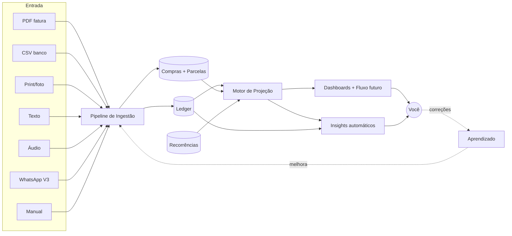
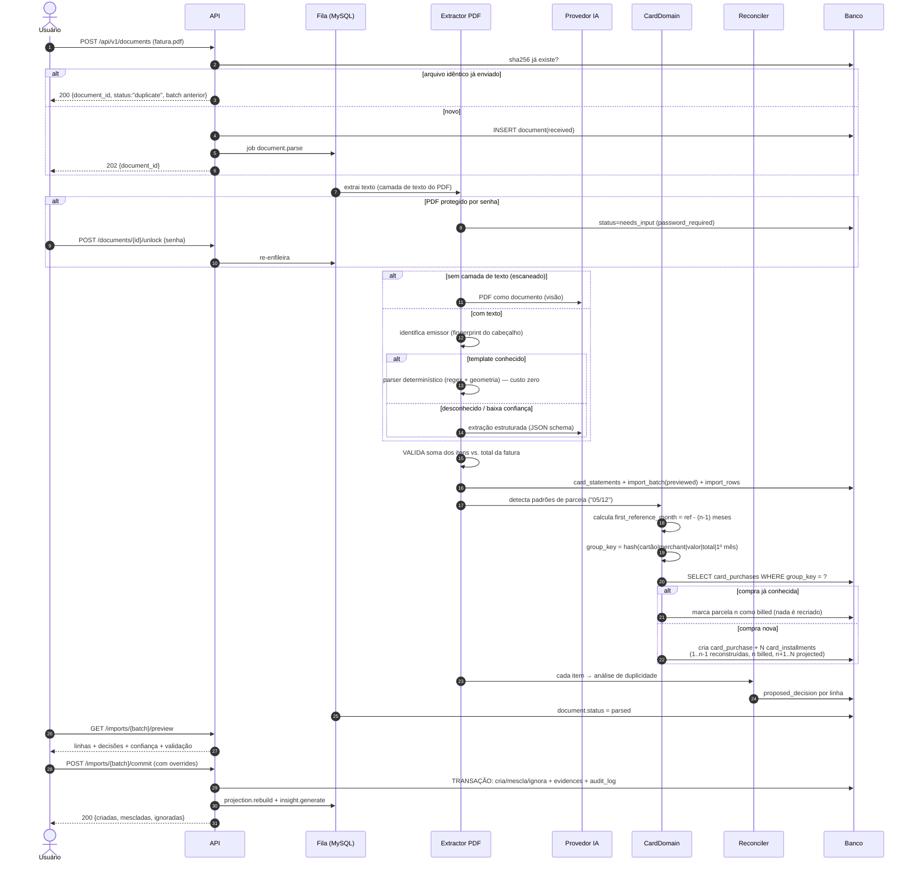
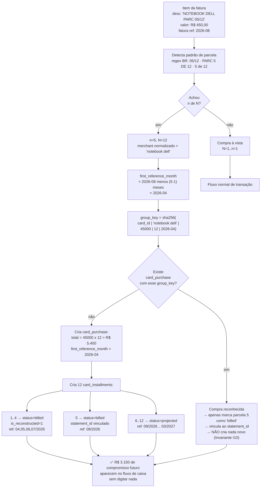
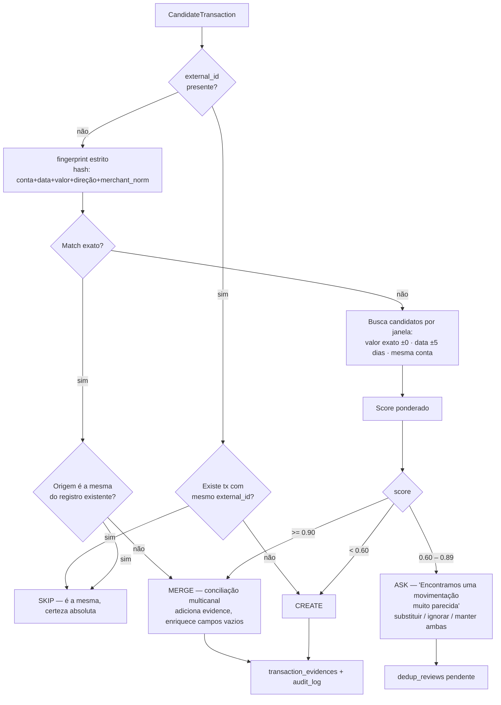
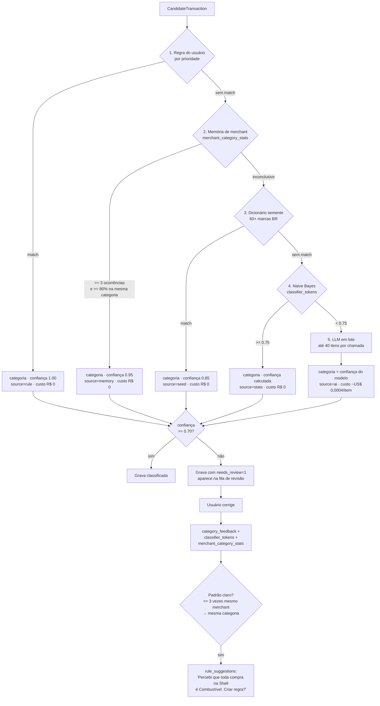
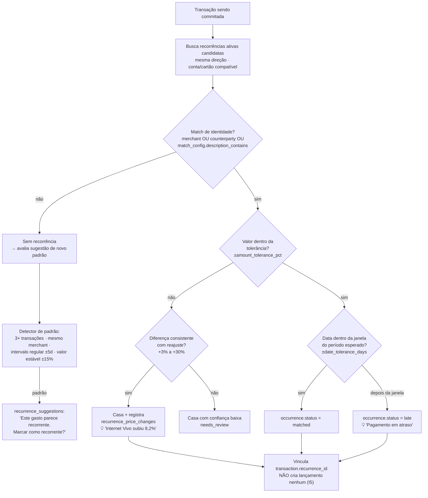
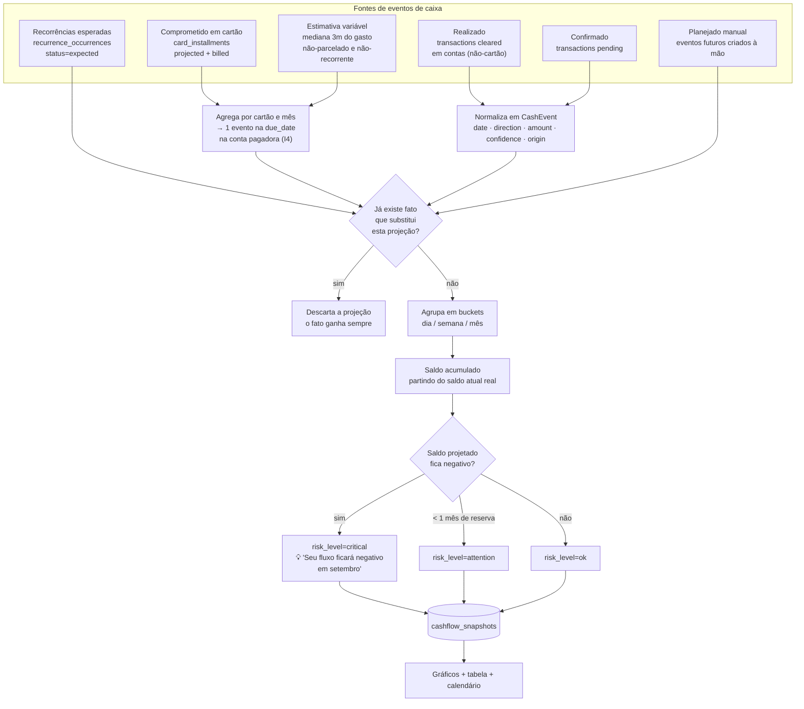
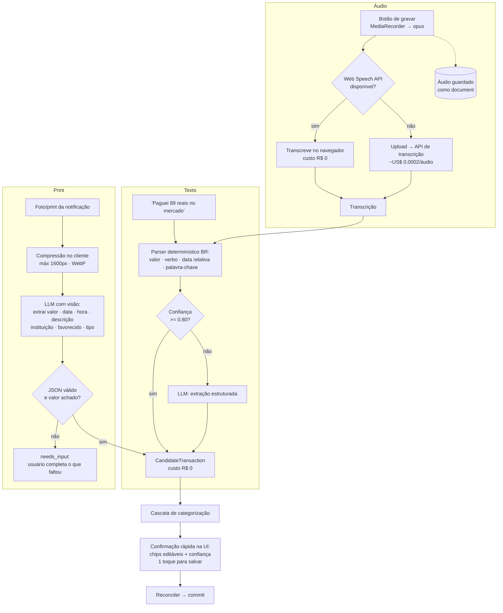
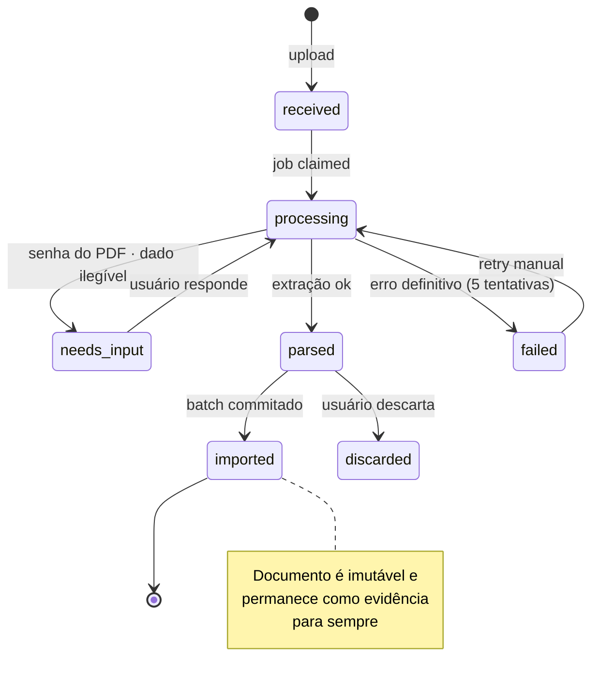
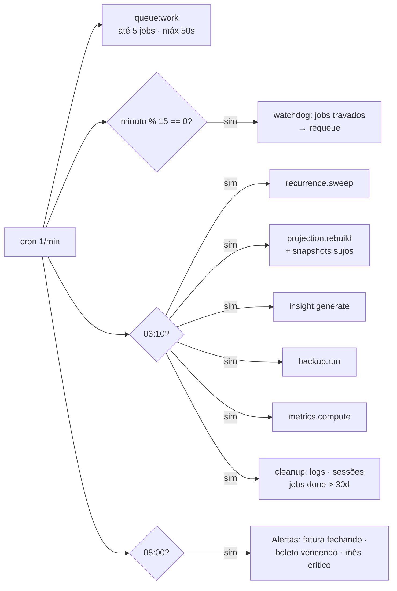

# 03 — Fluxogramas

## 1. Fluxo macro do produto

## 2. Importação de fatura de cartão (PDF) — o fluxo mais importante

## 3. Reconstrução de parcelas — o algoritmo

Entrada: fatura de **agosto/2026**, item `NOTEBOOK DELL   PARC 05/12   450,00`.

**Casos de borda tratados explicitamente:**

| Caso | Tratamento |
|------|-----------|
| Parcelas com centavos diferentes (`R$ 450,01` na 1ª) | `group_key` usa o valor da parcela **corrente**; se não casar, tenta match tolerante (±2 centavos) antes de criar compra nova |
| Fatura pulada (importei março e depois julho) | As parcelas intermediárias são criadas como `billed is_reconstructed=1`; ao importar as faturas do meio, elas são apenas **confirmadas** |
| Compra parcelada estornada | Item de crédito com mesmo merchant/valor → `purchase.status=refunded`, parcelas `projected` viram `canceled` |
| Parcelamento da própria fatura | `is_installment_plan=1`; não é gasto novo, é rolagem de dívida — excluído de "gastos por categoria", incluído no comprometimento |
| Juros/IOF/anuidade | Categorizados como Taxas bancárias, `installments_total=1` |
| Compra internacional | `original_amount`/`original_currency` guardados; valor em BRL é o que vale para o caixa |
| Cartão adicional / virtual | `credit_cards.is_virtual`, mesma fatura do titular via `account_id` |

## 4. Motor de decisão de duplicidade (conciliação)

**Pesos do score** (configuráveis em `user_settings`, calibrados com dados reais):

| Sinal | Peso | Observação |
|-------|------|-----------|
| Valor idêntico | 0,35 | valor diferente ⇒ score cai a quase zero |
| Data idêntica | 0,20 | ±1 dia: 0,15 · ±3 dias: 0,08 · ±5: 0,03 |
| Merchant/favorecido similar (trigram) | 0,20 | similaridade ≥ 0,85 |
| Mesmo método de pagamento | 0,10 | |
| Mesma conta/cartão | 0,10 | |
| Mesma parcela (n/N + group_key) | 0,25 | sinal decisivo em fatura |
| Descrição similar | 0,05 | |
| **Penalidade:** mesma origem e mesmo documento | −0,50 | duas linhas do mesmo CSV geralmente são gastos reais distintos |

## 5. Cascata de categorização (barato → caro)

**Efeito esperado ao longo do tempo** (é o que a métrica `metrics_daily` vai provar):

| Mês de uso | % resolvido sem IA | % que precisa de revisão manual |
|------------|--------------------|--------------------------------|
| 1 | ~55% (regras semente) | ~25% |
| 3 | ~85% | ~8% |
| 6+ | **~97%** | **< 3%** |

## 6. Casamento de recorrência (ADR-0010)

Job noturno `recurrence.sweep`: para cada recorrência ativa, gera as `occurrences` esperadas
do período e marca como `missed` as que passaram da janela sem casamento → alimenta insights
de "boleto não pago" e a projeção de saída futura.

## 7. Motor de fluxo de caixa projetado

## 8. Ingestão por texto, áudio e print

## 9. Estados de um documento

## 10. Ciclo do cron (a cada minuto)

