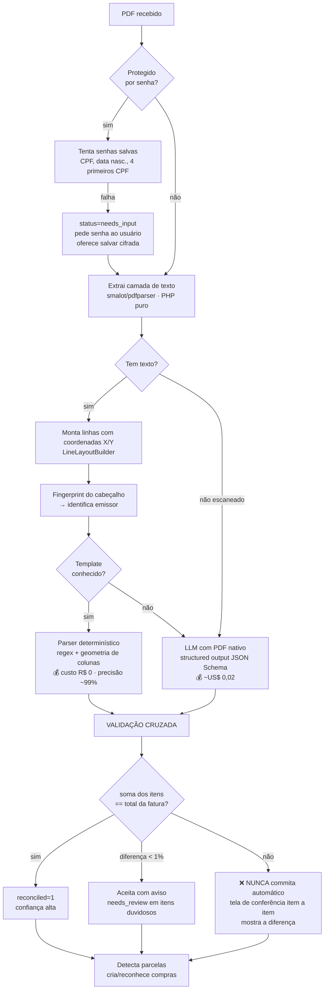
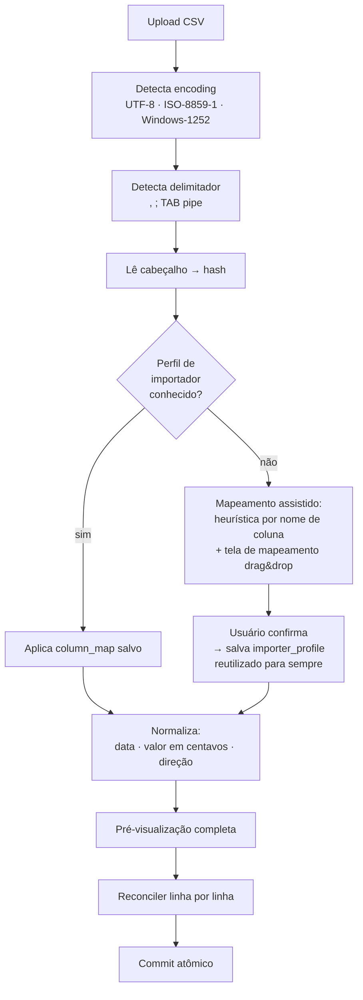
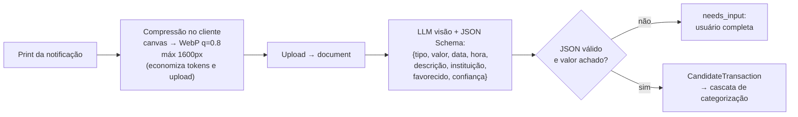
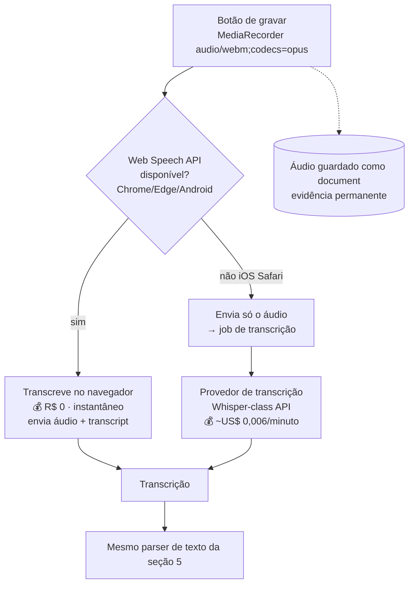
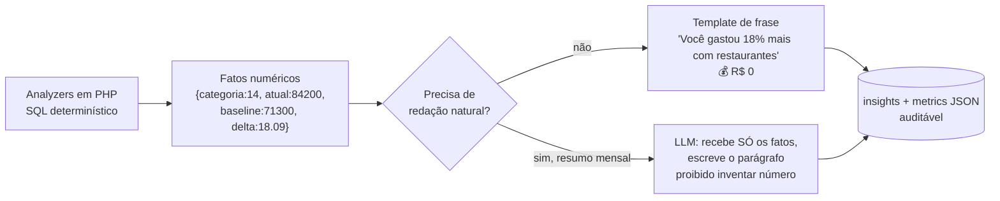

# 06 — Estratégias de Ingestão: PDF, CSV, OCR, Áudio, Texto e IA

## 0. Princípio econômico que rege tudo aqui

> **IA é o último recurso, nunca o primeiro.**

Cada etapa tem um caminho determinístico (custo R$ 0) e um caminho de IA (custo em USD). A IA só é
chamada quando o determinístico falha ou tem baixa confiança. Toda chamada é logada em `ai_calls`
com custo, e há **teto mensal configurável** (`BudgetGuard`) que degrada para "fila de revisão manual"
em vez de estourar orçamento.

---

## 1. Provedor de IA

| Necessidade | Escolha | Modelo | Preço (por 1M tokens) |
|-------------|---------|--------|----------------------|
| Classificação em lote, parsing de texto curto | **Claude Haiku 4.5** | `claude-haiku-4-5` | US$ 1,00 entrada / US$ 5,00 saída |
| Extração de fatura PDF, leitura de print (visão) | **Claude Sonnet 5** | `claude-sonnet-5` | US$ 3,00 entrada / US$ 15,00 saída |
| Insights mensais (raciocínio sobre números) | **Claude Sonnet 5** | `claude-sonnet-5` | idem |
| Transcrição de áudio | **não é Claude** — ver seção 6 | — | — |

**Por que Claude e não outro:**
1. **Aceita PDF nativamente** como `document` block (base64, até 32 MB / 100 páginas em modelo de 200K
   contexto) — inclusive **PDF escaneado**, resolvendo o caso mais difícil sem OCR local. Hospedagem
   compartilhada não tem Ghostscript/Tesseract/ImageMagick; isso elimina o bloqueio.
2. **Structured outputs** (`output_config.format` com JSON Schema) — a extração retorna JSON válido
   garantido, não texto para regex. Isso é a diferença entre um parser confiável e um gerador de bugs.
3. **Batch API** com 50% de desconto para classificação não urgente.
4. **Prompt caching** — o prompt de sistema (dicionário de categorias, regras de formato) é longo e
   idêntico em toda chamada; cacheado custa ~10% do preço de entrada.
5. **SDK PHP oficial** (`composer require anthropic-ai/sdk`) — só precisa de cURL, roda em host compartilhado.

Interface no domínio: `Domain/Ai/AiProvider` com implementações `ClaudeProvider`, `FakeProvider`
(testes determinísticos, zero custo) e `NullProvider` (modo 100% offline). **Trocar de provedor é
escrever uma classe.**

### Custo real estimado (uso pessoal típico)

| Item | Volume/mês | Custo unitário | Total |
|------|-----------|----------------|-------|
| Faturas PDF (extração com visão) | 4 | ~US$ 0,02 | US$ 0,08 |
| Prints de notificação (visão) | 30 | ~US$ 0,004 | US$ 0,12 |
| Classificação (só o que a cascata não resolveu, em lotes de 40) | ~40 itens | ~US$ 0,0004/item | US$ 0,02 |
| Parsing de texto/voz | 40 | ~US$ 0,0003 | US$ 0,01 |
| Insights mensais | 1 rodada | ~US$ 0,03 | US$ 0,03 |
| **Total** | | | **≈ US$ 0,26/mês** |

Com teto de segurança configurado em **US$ 5,00/mês** — ou seja, ~20× de folga. Nos primeiros meses
(sem memória de estabelecimentos) o custo sobe para ~US$ 1–2/mês e **cai** conforme o sistema aprende.
Este é o desenho: **o custo de IA decresce com o uso.**

### Privacidade — a decisão que o PO precisa tomar (ADR-0003)

Dados financeiros saem do servidor e vão para a API do provedor. Três posturas possíveis, com
prós e contras em `docs/adr/README.md#adr-0003`. Recomendação: **nuvem com redação de PII**
(CPF/CNPJ/nº de cartão/chave PIX mascarados antes do envio; valores e nomes de estabelecimento
preservados porque são o dado necessário). Isso preserva a capacidade e reduz a exposição.

**Independente da escolha:** `zero data retention` solicitado ao provedor, chave de API em `.env`
fora do webroot, `PiiRedactor` sempre no caminho, e log completo do que foi enviado (`ai_calls.input_hash`)
para auditoria.

---

## 2. Estratégia para PDF de fatura de cartão — o coração do produto



### 2.1 A validação cruzada é obrigatória (não opcional)

> **Atualizado em 2026-08-04 (ADR-0019):** nem todo canal traz um total para conferir — a fatura CSV do
> XP não tem total, mínimo nem vencimento, e uma fatura **aberta** não teria total conceitualmente.
> A validação passou a ser uma estratégia por perfil: **cadeia de saldo** (mais forte, quando o extrato
> traz saldo corrente), **soma × total** (quando existe) ou **conferência cruzada entre canais** (total
> da fatura fechada vs. pagamento no extrato do mês seguinte). O que segue vale para o caso 2.

Um parser de fatura que "quase acerta" é pior que nenhum parser: contamina 10 anos de histórico
silenciosamente. Por isso:

- extraímos também **total da fatura, total de compras, pagamentos, juros, encargos, mínimo**;
- `SUM(itens) + encargos - pagamentos` tem de fechar com `total_cents`;
- não fechando, o lote **nunca** é commitado automaticamente — vai para conferência.

Isso está codificado no invariante testável de `card_statements.reconciled`.

### 2.2 Templates de emissor (`Infrastructure/Pdf/Template/`)

```php
interface IssuerTemplate {
    public function matches(PdfDocument $doc): float;     // 0..1 — confiança de identificação
    public function extract(PdfDocument $doc): StatementData;
    public function key(): string;                        // 'nubank_v3'
}
```

- Um arquivo por emissor **e versão de layout** (`NubankStatementV3`). Bancos mudam o layout: por isso
  a versão está no nome e o registry escolhe pela maior confiança.
- `GenericHeuristicStatement` é o fallback determinístico: acha colunas por posição X, data por regex
  `dd/mm`, valor por regex de moeda BR (`1.234,56`), descrição pelo resto.
- **Ordem de trabalho:** o parser genérico primeiro (funciona parcialmente em quase tudo), e templates
  específicos são escritos conforme o PO envia faturas reais. Cada fatura real vira **fixture de teste**
  anonimizada em `tests/Fixtures/statements/` — é assim que a precisão sobe e nunca regride.

### 2.3 Regex de parcelas (Brasil)

```
/\bPARC(?:ELA)?\.?\s*(\d{1,2})\s*(?:\/|DE|-)\s*(\d{1,2})\b/i
/\((\d{1,2})\/(\d{1,2})\)/
/\b(\d{1,2})\s*\/\s*(\d{1,2})\b(?=\s|$)/      // "05/12" solto — exige validação de plausibilidade
/\b(\d{1,2})\s+DE\s+(\d{1,2})\b/i
```
Plausibilidade: `1 <= n <= N <= 72`, e `N > 1`. Sem isso, "12/03" (data) é lido como parcela.

### 2.4 Senha do PDF

Faturas brasileiras frequentemente vêm protegidas (CPF, data de nascimento). Tratamento:
`Encryptor` guarda uma lista de senhas do usuário cifrada com `APP_KEY`; o `PdfDecryptor` tenta todas;
se falhar, `needs_input` e a UI pede a senha uma vez, com opção de memorizar. PDFs com criptografia
que o PHP puro não abre → o usuário é orientado a reimprimir como PDF, e o caminho de visão via LLM
continua disponível.

### 2.5 Reprocessamento retroativo

`documents.extracted_text` guarda o texto cru para sempre. Quando um template melhorar em 2028,
`php bin/console reprocess:documents --from=2026-01` reprocessa **anos** de faturas sem baixar nada
de novo e sem custo de IA. Essa coluna é o que torna o sistema capaz de melhorar o passado.

---

## 3. Estratégia para CSV / OFX



**Detalhes que quebram importadores mal-feitos e que já estão previstos:**

| Armadilha | Tratamento |
|-----------|-----------|
| Decimal BR `1.234,56` vs US `1,234.56` | detecção por amostra da coluna, não por chute |
| Coluna única de valor com sinal vs. colunas débito/crédito separadas | `options.amount_mode`: `signed` \| `debit_credit` \| `absolute_with_type` |
| Datas `dd/mm/yyyy`, `yyyy-mm-dd`, `dd/mm/yy` | `options.date_format` + autodetecção |
| Cabeçalho não na 1ª linha (Itaú costuma ter 3 linhas de preâmbulo) | `options.skip_rows` |
| Linha de saldo/total no fim | filtro por padrão + validação de plausibilidade |
| BOM UTF-8 | strip explícito |
| Arquivo do banco com saldo do dia como linha | detectado e ignorado (`is_balance_row`) |
| OFX/QFX | `OfxImporter` (SGML simples, sem dependência externa) — V1 |

**Extensibilidade (requisito do PO):** `Domain/Import/Importer` é uma interface. Novo banco = nova
classe + registro no `TemplateRegistry`, **ou** simplesmente um novo `importer_profile` criado pelo
próprio usuário na UI, sem código nenhum. É esse segundo caminho que garante longevidade.

---

## 4. Estratégia para prints/imagens (o "OCR")

**Não usamos OCR clássico.** Tesseract não está disponível em hospedagem compartilhada e, mais
importante, OCR devolve texto solto que ainda precisaria de NLU para virar dado estruturado — dois
pontos de falha em vez de um.

**Usamos LLM com visão em uma etapa:** imagem → JSON estruturado.



Schema de extração (resumido):

```jsonc
{
  "type": "object", "additionalProperties": false,
  "required": ["kind","amount_cents","confidence"],
  "properties": {
    "kind": {"enum":["pix_sent","pix_received","boleto","ted","transfer","card_purchase","card_refund","withdrawal","deposit","unknown"]},
    "amount_cents": {"type":"integer"},
    "occurred_on": {"type":["string","null"], "format":"date"},
    "occurred_time": {"type":["string","null"]},
    "description": {"type":["string","null"]},
    "institution": {"type":["string","null"]},
    "counterparty_name": {"type":["string","null"]},
    "counterparty_document_masked": {"type":["string","null"]},
    "installments": {"type":["object","null"], "properties":{"number":{"type":"integer"},"total":{"type":"integer"}}},
    "confidence": {"type":"number"},
    "notes": {"type":["string","null"]}
  }
}
```

**Regra de ouro:** o print original fica guardado como `document` e vinculado como
`transaction_evidences.role = 'screenshot'`. Se em 2030 quisermos reextrair com um modelo melhor,
a imagem ainda está lá.

---

## 5. Estratégia para texto ("Paguei 89 reais no mercado")

**Parser determinístico primeiro** (`Infrastructure/Nlu/`), porque 80% das frases seguem padrão:

| Componente | Como |
|-----------|------|
| Valor | `R$ 89,90`, `89 reais`, `89,90`, `1.200`, `89 pila`, `mil e duzentos` (números por extenso PT-BR) |
| Direção | verbos de saída (`paguei, gastei, comprei, abasteci, torrei`) vs. entrada (`recebi, entrou, caiu, ganhei`) |
| Data | `hoje`, `ontem`, `anteontem`, `sexta`, `dia 5`, `05/08`, `semana passada` |
| Método | `pix`, `no cartão`, `no débito`, `dinheiro`, `boleto`, `ted` |
| Pessoa | `do João`, `pra Maria`, `para o João` → busca em `counterparties` |
| Categoria | palavra-chave → dicionário semente (`mercado`, `abastecer`→Combustível, `uber`→Transporte) |

Se `confidence >= 0.80` → candidato pronto, **custo zero**. Abaixo disso, LLM com o mesmo JSON Schema.

**Sempre há confirmação na UI** — chips editáveis com valor/categoria/conta e um toque para salvar.
Nunca gravamos silenciosamente algo interpretado de linguagem natural sem o usuário ver (requisito
"qualidade dos dados" do PO).

---

## 6. Estratégia para áudio

Claude não recebe áudio. Duas camadas:



- Interface `Domain/Ai/TranscriptionProvider` com `BrowserProvidedTranscript` (grátis) e
  `WhisperApiProvider`. O front sempre manda o áudio; se mandou transcript, o servidor **valida
  plausibilidade** e usa; senão enfileira transcrição.
- Custo real: um áudio de 5 segundos ≈ US$ 0,0005. Irrelevante, mas o caminho grátis é o padrão.
- Limite: 60 s por gravação, 5 MB. Áudio guardado — se a transcrição errar, é possível reprocessar.
- iOS/Safari não tem Web Speech API confiável → sempre servidor. Testar isso é item de aceite do MVP,
  porque celular é o cenário principal.

---

## 7. Insights com IA (seção "inteligência" do PO)

**Os números nunca são calculados pela IA.** Isso é regra dura: um LLM não faz aritmética confiável
sobre 10 anos de lançamentos, e um insight financeiro errado destrói a confiança no produto.



`insights.metrics` guarda os números por trás de cada frase → toda afirmação é **clicável e auditável**.
Analyzers do MVP/V1: `CategorySpike`, `NegativeForecast`, `CommittedTotal`, `SubscriptionAudit`,
`TopMerchants`, `PriceIncrease`, `MissedPayment`, `SavingsRate`, `UnusualTransaction`.

---

## 8. Engenharia de prompts como código

- Prompts em arquivos versionados: `Infrastructure/Ai/Prompt/statement_extract.v1.txt`. **Nunca**
  string dentro de classe — prompt é comportamento e precisa de diff, revisão e rollback.
- Versão no nome (`v1`, `v2`): `ai_calls` registra qual versão gerou cada resultado. Se a v2 piorar,
  sabemos exatamente o que reverter e quais dados foram afetados.
- Toda resposta passa por `ResponseValidator` (JSON Schema). Resposta inválida = falha do job com
  retry, nunca gravação de lixo.
- `ResponseCache` por `input_hash`: reprocessar o mesmo documento não paga duas vezes.
- Prompt de sistema (categorias, formato, regras) marcado com `cache_control` → ~90% de desconto na
  parte repetida.
- Classificação em **lote de até 40 itens por chamada** e, quando não urgente, via **Batch API (−50%)**.
- `FakeProvider` em testes: a suíte roda offline, determinística e sem custo. Sem isso, testar
  ingestão fica caro e as pessoas param de testar.

## 9. Modo degradado (o sistema nunca para)

| Falha | Comportamento |
|-------|---------------|
| API de IA fora do ar | Job em retry com backoff; itens vão para fila de revisão manual; UI mostra aviso, nada se perde |
| Teto de custo mensal atingido | `BudgetGuard` desliga IA; cascata determinística continua funcionando; alerta por e-mail |
| Chave de API ausente | `NullProvider`: sistema 100% funcional com regras + estatística + entrada manual |
| Provedor descontinuado/preço mudou | Trocar a implementação de `AiProvider`. Zero mudança em domínio, banco ou UI |

Este último ponto é o motivo de toda essa abstração: **em 5 anos o provedor de IA de hoje pode não
existir. O sistema tem de existir.**
