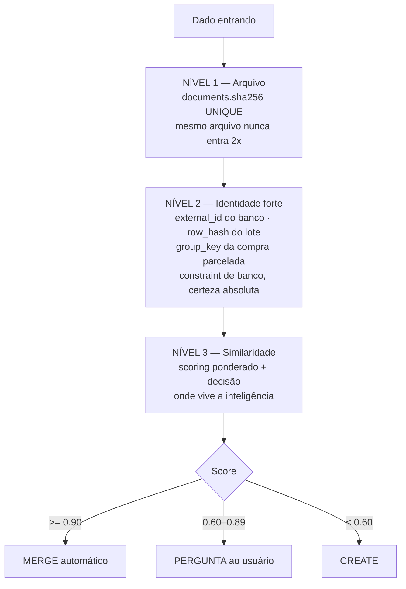
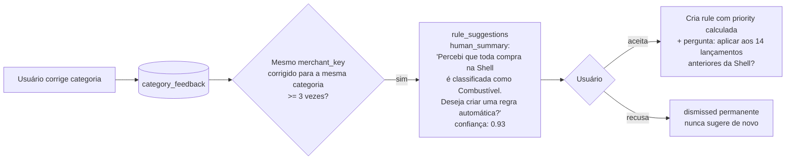
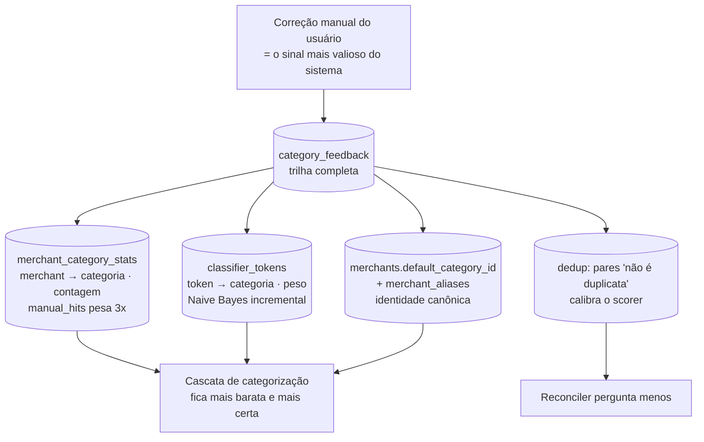

# 07 — Inteligência: Duplicidade, Conciliação, Recorrências, Regras e Aprendizado

Este documento detalha os requisitos mais críticos do PO: **nunca duplicar**, **recorrência como
agrupador** e **aprender com as correções**.

---

## 1. Conciliação e prevenção de duplicidade (Princípio P1)

### 1.1 Os três níveis de defesa



Níveis 1 e 2 são **constraints de banco** — não dependem de código estar correto. Nível 3 é
algoritmo + usuário. Essa separação importa: bugs de aplicação não conseguem violar os dois
primeiros.

### 1.2 Os fingerprints

```
fingerprint (estrito) = sha256(
    user_id | account_id | occurred_on | amount_cents | direction | merchant_normalized_key
)

fingerprint_loose = sha256(
    user_id | amount_cents | direction | merchant_normalized_key
)   -- sem data e sem conta: pega a mesma compra vista por canais diferentes
```

`merchant_normalized_key` é produzido por `MerchantNormalizer`:
minúsculas → remove acentos → remove ruído de maquininha (`*`, `**`, códigos de 4+ dígitos, `LTDA`,
`ME`, `EIRELI`, cidade/UF no fim, `PARC xx/yy`, `PAG*`, `MP*`, `IFD*`) → colapsa espaços.

```
'MERCADO ANGELONI 442 FLORIANOPOLIS SC'  → 'mercado angeloni'
'PAG*IFOOD    SAO PAULO BR'              → 'ifood'
'SHELL BOX 4412 *PARC 01/03'             → 'shell box'
```

Casos reais do Visa Black XP que **têm** de colapsar para a mesma chave (fixtures de teste):
`MP*MERCADOLIVRE` · `MP *MERCADOLIVRE` · `MERCADOLIVRE*MERCADOLIVRE` → `mercadolivre`;
`DM          *TEMU` · `GNT*TEMU` · `TEMU.COM` → `temu`.
Lista completa de prefixos de gateway observados nos dados em `docs/13-perfis-importadores-xp.md#25`.

Essa normalização é a base de **tudo**: dedup, memória de merchant, recorrência e regras. É a
função mais testada do projeto (dezenas de casos reais em `tests/Unit/Classification/MerchantNormalizerTest.php`).

### 1.3 Scoring de similaridade

Pesos em `docs/03-fluxos.md#4`. Pontos de desenho relevantes:

- **Valor diferente ⇒ score ~0.** Duas transações de valores diferentes não são a mesma. Sem essa
  regra, o sistema começa a "mesclar" coisas distintas — o pior erro possível num app financeiro.
- **Similaridade de nome por trigramas** (implementado em PHP puro, sem extensão de banco), limiar 0,85.
- **Penalidade de mesma origem** (−0,50): duas linhas do mesmo CSV com mesmo valor e data são
  quase sempre dois gastos reais (dois cafés), não duplicata. Sem essa penalidade, o sistema
  come lançamentos legítimos — falha silenciosa e gravíssima.
- **Bônus de parcela**: mesmo `group_key` + mesmo `n/N` é sinal decisivo.
- Pesos ficam em `user_settings` e são **calibrados com dados reais** durante o MVP.

### 1.4 O que "merge" faz exatamente

Merge **não sobrescreve** — enriquece:

```
Transação existente (origem: OCR do print)     Chegando (origem: PDF da fatura)
  valor: 8900                                    valor: 8900
  data: 2026-08-02                               data: 2026-08-02
  descrição: "Angeloni"                          descrição: "MERCADO ANGELONI 442"
  categoria: Mercado (usuário confirmou)         categoria: sugerida = Mercado
  anexo: print.png                               statement_id: 44

RESULTADO: um único registro
  ✓ mantém a categoria confirmada pelo usuário (dado humano > dado de máquina)
  ✓ preenche statement_id que estava vazio
  ✓ mantém raw_description da fonte mais rica
  ✓ ganha uma segunda transaction_evidence (pdf) — o print continua anexado
  ✓ audit_log registra o merge com o "antes"
```

**Precedência de campos no merge:** `user > pdf(fatura oficial) > csv(banco) > ocr > text/audio`.
Campo já preenchido por fonte de maior precedência nunca é sobrescrito por fonte menor.

### 1.5 A pergunta ao usuário

Quando `0.60 <= score < 0.90`, a UI mostra as duas lado a lado com os motivos em linguagem natural
("mesmo valor", "1 dia de diferença", "estabelecimento 91% parecido", "origem diferente") e oferece:

| Opção | Efeito |
|-------|--------|
| **Substituir** | mantém 1 registro, os dados da nova fonte ganham precedência, evidências preservadas |
| **Ignorar** | descarta a nova, mas registra a evidência na existente (marca que foi vista por outro canal) |
| **Manter ambas** | cria a nova; **grava um par em `dedup_reviews` como "não é duplicata"** → o scorer aprende e não pergunta de novo para esse padrão |

A terceira opção é a que o sistema **aprende com**: cada "manter ambas" é sinal negativo de treino.

### 1.6 Reversibilidade

- `POST /imports/{batch}/rollback` desfaz um lote inteiro (janela de 7 dias) usando `import_rows.target_transaction_id`.
- Merge é reversível: `transaction_evidences.merged_from_transaction_id` guarda o que foi absorvido.
- Nada é deletado fisicamente (I9).

**Por que isso importa mais que a precisão do algoritmo:** um algoritmo 95% preciso com desfazer
perfeito é utilizável por 10 anos. Um algoritmo 99% preciso sem desfazer destrói a confiança na
primeira vez que erra.

---

## 2. Recorrências — agrupador, nunca gerador (ADR-0010)

### 2.1 A regra e o motivo

> Marcar algo como recorrente **não cria lançamentos futuros**. A recorrência serve para **reconhecer**
> pagamentos que chegarem nas próximas importações e agrupá-los.

Geradores de lançamento são a causa nº 1 de lixo em apps financeiros: geram 12 parcelas de "Internet",
depois o CSV do banco traz o pagamento real, e você tem 24 registros. O modelo do PO é o correto, e
o invariante **I5** garante isso em teste automatizado.

### 2.2 O que existe então para a projeção?

`recurrence_occurrences` — **expectativas**, não lançamentos. Vivem numa tabela própria, jamais em
`transactions`, e alimentam apenas o motor de fluxo de caixa. Uma expectativa nunca aparece na lista
de movimentações, nunca soma em "gastos por categoria" do realizado, nunca é editável como transação.

### 2.3 Casamento

Ver fluxo em `docs/03-fluxos.md#6`. Configuração por recorrência:

```jsonc
// recurrences.match_config
{
  "description_contains": ["vivo", "fibra"],
  "regex": null,
  "merchant_ids": [12],
  "counterparty_ids": [],
  "require_amount_in_tolerance": true,
  "amount_tolerance_pct": 15.0,
  "date_tolerance_days": 5,
  "exclude_if_contains": ["celular"]     // evita casar a conta do celular com a da internet
}
```

`exclude_if_contains` existe porque, na prática, "Vivo Internet" e "Vivo Celular" colidem. Casos
como esse são o que separa um matcher que funciona de um que irrita.

### 2.4 Detecção de reajuste

Quando um pagamento casa mas o valor está fora da tolerância **de forma consistente com aumento**
(+3% a +30%), o sistema:
1. casa a ocorrência;
2. grava `recurrence_price_changes`;
3. atualiza `expected_amount_cents`;
4. gera insight: *"Internet Vivo subiu 8,2% (R$ 119,90 → R$ 129,90)"*.

Se a variação for negativa ou absurda (>50%), casa com `needs_review` e pergunta.

### 2.5 Métricas exigidas pelo PO (todas atendidas)

| Requisito | Como é obtido |
|-----------|---------------|
| há quanto tempo pago | `started_on` → hoje (`months_active`) |
| média de valor | `AVG(actual_amount_cents)` das ocorrências casadas |
| último reajuste | último `recurrence_price_changes` |
| histórico de aumentos | lista completa com % |
| pagamentos em atraso | ocorrências `late` |
| recorrências canceladas | `status = canceled` + `cancel_reason` + data |
| total mensal comprometido | soma das ativas normalizada para mês |
| nº de assinaturas | count de `kind = subscription` ativas |

### 2.6 Sugestão automática (nunca criação automática)

Detector (`PatternDetector`) roda no sweep noturno: agrupa por **`(favorecido/merchant, cluster de
valor ±15%)`** — ver **ADR-0021**, correção obrigatória comprovada com dados reais — e então avalia
regularidade do intervalo. Mínimo de 3 ocorrências, ou 2 quando o intervalo é mensal (28–33 dias).
Grava `recurrence_suggestions` e a UI pergunta **"Este gasto parece ser recorrente. Deseja marcar como
recorrente?"**.

> ⚠️ Agrupar **só** por favorecido erra o caso mais importante: a Escola Riacho Doce emite três boletos
> no mesmo dia (R$ 236,73 + R$ 745,00 + R$ 1.419,00, repetidos todo mês). Sem o cluster de valor, os
> intervalos viram `[0,0,…]`, a variação de valor explode para 2.738% e o detector descarta três
> mensalidades escolares de valor alto. Detalhes em `docs/adr/0021-...md`.

`signature` UNIQUE evita sugerir o mesmo padrão duas vezes. `dismissed` é permanente — o sistema
nunca insiste. Requisito explícito do PO: **nunca criar recorrência automaticamente.**

---

## 3. Regras de categorização

### 3.1 Motor

- Avaliação por `priority` crescente; `stop_on_match` (padrão true) encerra na primeira.
- Condições em `conditions` JSON (formato em `docs/02-modelo-de-dados.md#27`), operadores:
  `equals`, `equals_ci`, `contains_ci`, `starts_with_ci`, `regex`, `in`, `between`, `gt`, `lt`, `is_null`, `not`.
- Campos avaliáveis: `raw_description`, `description`, `merchant_key`, `counterparty_name`,
  `amount_cents`, `direction`, `payment_method`, `account_id`, `credit_card_id`, `occurred_on` (dia da semana/mês).
- Ações: `set_category_id`, `set_merchant_id`, `set_counterparty_id`, `add_tags`, `link_recurrence_id`,
  `set_needs_review`, `exclude_from_analytics`, `set_notes`.
- `regex` executado com timeout e validação prévia (proteção contra ReDoS).

### 3.2 Ferramentas que fazem regras serem realmente usáveis

| Recurso | Por que é essencial |
|---------|--------------------|
| `POST /rules/{id}/test` (dry-run) | mostra quantas e quais transações históricas casariam, **antes** de salvar |
| `POST /rules/{id}/apply` | aplica retroativamente, com preview e registro em `audit_log` (reversível) |
| `match_count` + `last_matched_at` | revela regras mortas e regras que estão pegando demais |
| Reordenação por arrastar | prioridade é conceito difícil em texto, trivial em UI |
| Regras semente (~60 marcas BR) | 55% de acerto no **primeiro dia**, sem histórico e sem custo de IA |

### 3.3 Sugestão de regra a partir do comportamento (requisito do PO)



Também detecta padrões de **favorecido** (`PIX para João` → Família) e de **descrição**
(`contém "Uber"` → Transporte), exatamente os exemplos do PO.

---

## 4. Modelo de aprendizado

Quatro memórias distintas, todas em SQL, todas incrementais, todas auditáveis. Sem treino de modelo,
sem pipeline de ML, sem dependência externa.



### 4.1 Naive Bayes em SQL (sem biblioteca)

```sql
-- Classificar: tokens da descrição normalizada
SELECT category_id, SUM(LOG((weight + 1) / (:total_for_cat + :vocab))) AS score
FROM classifier_tokens
WHERE user_id = :u AND token IN (:tokens)
GROUP BY category_id
ORDER BY score DESC
LIMIT 3;
```
- Aprender é `INSERT ... ON DUPLICATE KEY UPDATE weight = weight + :w`.
- Correção manual: `w = 3`. Confirmação implícita (usuário não mexeu em 7 dias): `w = 1`.
- **Desaprender também existe**: ao corrigir, o peso da categoria errada é decrementado. Sem isso
  o modelo só acumula ruído e degrada com o tempo.
- `php bin/console reindex:classifier` reconstrói tudo do histórico — recuperação total se corromper.

### 4.2 Por que não um modelo de ML de verdade

| | Naive Bayes em SQL | Modelo treinado |
|---|---|---|
| Infra | nenhuma | serviço Python, treino, deploy |
| Latência | ~2 ms | rede |
| Explicabilidade | total (tokens visíveis) | opaca |
| Aprende na hora | sim | precisa retreinar |
| Precisão neste domínio | ~90% após 3 meses | ~92% |
| Custo | R$ 0 | infra + manutenção por anos |

Os 2% de diferença são cobertos pelo LLM no último degrau da cascata. **Complexidade não paga aqui.**

### 4.3 Como a meta de 95% é atingida e provada

| Camada | Contribuição acumulada |
|--------|-----------------------|
| Regras semente (60 marcas BR) | ~55% no dia 1 |
| Memória de merchant após 1 mês | ~75% |
| Regras criadas pelo usuário (sugeridas) | ~85% |
| Naive Bayes após 3 meses | ~92% |
| LLM no restante | ~97% classificado, **<3% precisa de revisão** |

`metrics_daily` mede `tx_auto_classified / tx_created` todo dia e expõe em `/admin/health`. **A meta
do PO é um número medido no produto, não uma promessa em documento.**

### 4.4 Aprendizado explícito de identidade

- **Merge de merchants**: unificar "Angeloni" e "Mercado Angeloni" cria alias e reclassifica histórico.
- **Merge de categorias**: reclassifica em lote com auditoria.
- **Merge de counterparties**: "João", "João Silva", "Joao S" → uma pessoa, com chaves PIX associadas.

Sem essas três operações, a memória do sistema fragmenta em 2 anos e a precisão cai. São features de
MVP, não de V3.
