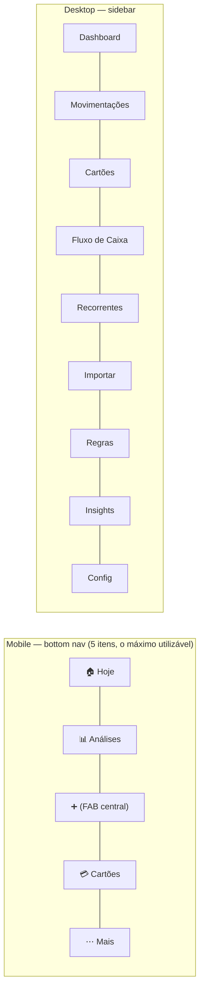

# 08 — UX, Design System e Telas

## 1. Princípios de UX

| # | Princípio | Consequência de projeto |
|---|-----------|------------------------|
| U1 | **Registrar tem de custar menos que não registrar** | captura rápida acessível de qualquer tela em 1 toque; nada de formulário de 12 campos |
| U2 | **O futuro na frente** | a home não é "quanto gastei", é "o que vem" |
| U3 | **Nunca mentir sobre certeza** | tudo que a IA inferiu carrega badge de confiança; projeção é visualmente distinta do realizado |
| U4 | **Mobile é o padrão, não a adaptação** | desenho começa em 375px; bottom nav, toques de 44px, gestos |
| U5 | **Nenhum beco sem saída** | todo estado vazio, erro e carregamento tem texto útil e ação |
| U6 | **Dark mode é o padrão** | tela usada de noite, no sofá, no celular |

## 2. Design tokens

```css
:root {
  /* Superfícies (dark = padrão) */
  --bg:        #0B0F14;   /* fundo */
  --surface-1: #131A22;   /* cards */
  --surface-2: #1B242E;   /* elevado, modais */
  --border:    #253040;

  /* Texto */
  --text:      #E8EDF2;
  --text-dim:  #93A1B0;
  --text-mute: #5C6B7A;

  /* Semântica financeira — nunca só cor: sempre + sinal/ícone (acessibilidade) */
  --in:        #34D399;   /* entrada */
  --out:       #F87171;   /* saída */
  --neutral:   #60A5FA;   /* transferência */
  --projected: #A78BFA;   /* projetado */
  --warn:      #FBBF24;
  --critical:  #EF4444;

  --accent:    #22D3EE;

  /* Escala de categorias — 12 tons distinguíveis também em deuteranopia */
  --cat-1:#22D3EE; --cat-2:#A78BFA; --cat-3:#34D399; --cat-4:#FBBF24;
  --cat-5:#FB7185; --cat-6:#60A5FA; --cat-7:#F472B6; --cat-8:#4ADE80;
  --cat-9:#FDBA74; --cat-10:#818CF8; --cat-11:#2DD4BF; --cat-12:#94A3B8;

  --radius: 14px;
  --shadow: 0 4px 24px rgb(0 0 0 / .35);
}
```

- Tipografia: `Inter` variável (auto-hospedada, sem CDN — a CSP proíbe host externo) + **tabular-nums
  obrigatório em toda coluna de valor** (números têm de alinhar; é o detalhe que faz uma tabela
  financeira parecer profissional).
- Light mode: mesmos tokens invertidos, via `[data-theme="light"]`. Preferência salva em `user_settings`,
  padrão = sistema.
- Escala de espaço 4px. Nada de valores mágicos.

## 3. Estrutura de navegação



**Mais** contém: Movimentações, Fluxo de Caixa, Recorrentes, Importar, Regras, Insights, Revisão,
Configurações. Cinco itens no bottom nav porque o sexto nunca é tocado.

## 4. Telas

### 4.1 Hoje (home)

Ordem deliberada — o futuro antes do passado (U2):

1. **Saldo atual** consolidado + variação do mês.
2. **⚠️ Alerta crítico** (se houver): *"Seu saldo projetado fica negativo em outubro (R$ -567,00)"* — clicável.
3. **Próximos 30 dias**: minigráfico de fluxo + 3 maiores compromissos com data.
4. **Fatura atual** de cada cartão: valor, dias até fechar/vencer, barra de limite.
5. **Comprometido em parcelas**: número grande + "em N meses".
6. **Feed de insights** (3 mais recentes).
7. **A revisar** (badge com contagem) — só aparece se houver.
8. **Últimas movimentações** (5) + "ver todas".

### 4.2 Captura rápida (o FAB) — a tela mais importante do produto

```
┌─────────────────────────────┐
│  ⌨️  Escrever    🎤  Falar  │
│  📷  Foto        📄  Arquivo│
└─────────────────────────────┘
```

- **Escrever**: um campo. `Paguei 89 no mercado` → chips interpretados aparecem **abaixo, ao vivo**
  (R$ 89,00 · hoje · Mercado · Conta Itaú) com confiança. Enter salva. Zero navegação.
- **Falar**: botão de pressionar-e-segurar, waveform ao vivo, transcrição aparecendo, mesmos chips.
- **Foto**: câmera direta ou galeria, compressão no cliente, spinner com progresso real do job.
- **Arquivo**: PDF/CSV → vai para o fluxo de importação com preview.

Regra dura: qualquer chip é editável com um toque, e nada é salvo sem o usuário ver o resultado.

### 4.3 Movimentações

- Lista virtualizada agrupada por dia com subtotal diário.
- Cada linha: ícone da categoria · descrição · badge de parcela `5/12` · badge de recorrência ·
  📎 se tem anexo · valor com sinal e cor.
- Filtros como chips horizontais (período, conta, categoria, tipo, "só a revisar", "só com anexo").
- **Ações em lote**: seleção múltipla → categorizar, tag, excluir de análises.
- Toque abre **bottom sheet** (mobile) / painel lateral (desktop): edição inline, anexos com preview,
  evidências (de onde este dado veio), histórico de alterações, botões split/merge.

### 4.4 Cartões — a tela que resolve o objetivo nº 1 do PO

```
┌──────────────────────────────────────────────────┐
│  Nubank ····4821          Vence dia 10           │
│  Fatura atual (ago)             R$ 2.890,50      │
│  ████████████░░░░░░░░  Limite: 4.321 / 15.000    │
│                                                  │
│  💰 Comprometido em parcelas    R$ 4.300,00      │
│     em 7 meses · 5 compras                       │
├──────────────────────────────────────────────────┤
│  PRÓXIMAS FATURAS (12 meses)                     │
│  [gráfico de barras empilhadas:                  │
│   parcelas · recorrentes · estimativa variável]  │
│  ago 2.890 (fechada) · set 2.769 · out 2.410 ... │
├──────────────────────────────────────────────────┤
│  COMPRAS PARCELADAS EM ANDAMENTO                 │
│  Notebook Dell    5/12   R$ 450   restam 3.150   │
│  ▓▓▓▓░░░░░░░░  termina em mar/2027               │
│  Celular          9/10   R$ 189   restam   189   │
│  ▓▓▓▓▓▓▓▓▓░  termina em set/2026                 │
├──────────────────────────────────────────────────┤
│  CALENDÁRIO DE COBRANÇAS FUTURAS                 │
│  [heatmap mensal com valores por vencimento]     │
└──────────────────────────────────────────────────┘
```

Clicar numa compra parcelada abre a linha do tempo das N parcelas com status por mês
(paga / cobrada / projetada), origem de cada uma e botão de corrigir/cancelar.

### 4.5 Fluxo de caixa

- Gráfico de linha: **realizado em traço cheio, projetado em traço pontilhado** com banda de confiança
  (U3 — nunca desenhar projeção como se fosse fato).
- Zonas negativas com fundo vermelho translúcido.
- Toggle dia/semana/mês/ano; toggle "incluir estimativa de gasto variável".
- Tabela abaixo: entradas, saídas, saldo, e **breakdown clicável** de cada mês (o que compõe a saída:
  parcelas / recorrentes / planejado / estimado).
- **Simulador** (V1): "e se eu parcelar R$ 3.000 em 10x?" → sobrepõe cenário no gráfico.

### 4.6 Análises (dashboards)

Todos os gráficos exigidos pelo PO, em Chart.js, com tema unificado (`charts/chartTheme.js`):

| Gráfico | Tipo | Detalhe |
|---------|------|---------|
| Gastos por categoria | rosca + tabela | clique → drill-down em subcategoria → transações |
| Evolução mensal | barras | 13 meses, com linha de média |
| Entradas × saídas | barras agrupadas | + linha de taxa de poupança |
| Comparativo mensal | barras com Δ% | mês vs. mês anterior vs. média 3m |
| Fluxo de caixa | linha | realizado + projetado |
| Cartão de crédito | barras empilhadas | composição das próximas faturas |
| Parcelas futuras | área empilhada | comprometimento por mês por compra |
| Top estabelecimentos | barras horizontais | top 10 com nº de visitas e ticket médio |
| Top categorias | barras horizontais | com Δ% vs. período anterior |
| Heatmap de gastos | grade ano×dia | intensidade por gasto diário |
| Calendário financeiro | mês | vencimentos, faturas, salário, recorrentes |
| Previsão próximos meses | linha | com banda de confiança |

**Regras de gráfico:** nunca sem rótulo de valor; nunca cor como único diferenciador; nunca eixo Y
truncado (distorce percepção de valor); tooltip com valor formatado em BRL; tudo responsivo com
scroll horizontal próprio (nunca o body rolando).

### 4.7 Importação (preview → commit)

```
┌────────────────────────────────────────────────────────┐
│  fatura-agosto.pdf · Nubank · ago/2026                 │
│  ✅ Validação: soma dos itens = total (R$ 2.890,50)    │
│  42 linhas → 38 criar · 2 mesclar · 2 ignorar · 0 ⚠️  │
│  🆕 1 nova compra parcelada · ✓ 3 reconhecidas         │
├────────────────────────────────────────────────────────┤
│ ☑ 02/08  Angeloni          R$   89,00  Mercado  97% ✓ │
│ ☑ 05/08  Notebook Dell 5/12 R$  450,00  Eletrô.  99% ✓│
│      ↳ 🔮 projeta 7 parcelas · R$ 3.150 comprometidos │
│ ⚠ 07/08  Uber Trip         R$   23,40  MESCLAR        │
│      ↳ muito parecida com #8102 (print de 07/08)      │
│      ↳ [substituir] [ignorar] [manter ambas]          │
│ ☑ 12/08  XPTO COM 4471     R$  156,00  ❓ 42%  [▾]    │
├────────────────────────────────────────────────────────┤
│           [Descartar]        [Confirmar importação]    │
└────────────────────────────────────────────────────────┘
```

Nada é gravado antes do "Confirmar" (requisito explícito do PO). Categorias editáveis inline no preview.

### 4.8 Recorrentes

Cards com: nome, valor atual, frequência, próximo vencimento, sparkline do histórico de valores,
badge de reajuste (`↑ 8,2% em fev/2026`), meses ativos, total já pago. Filtros: ativas / pausadas /
canceladas / em atraso. Header com total mensal comprometido e nº de assinaturas.

### 4.9 Revisão (fila única de pendências)

Um lugar só, com contador no nav: baixa confiança de categoria, possíveis duplicatas, sugestões de
regra, sugestões de recorrência, documentos que falharam, faturas não reconciliadas. Cada item com
ação primária de 1 toque e "resolver todos os fáceis" em lote.

Sem essa tela, as pendências viram dívida invisível e o sistema apodrece.

## 5. Padrões de interação

| Padrão | Regra |
|--------|-------|
| Salvamento | otimista com rollback visual em erro; toast com **Desfazer** (5 s) |
| Confiança | badge `97%` verde ≥90 · amarelo 70–89 · laranja <70 (+ ícone, não só cor) |
| Projetado vs. realizado | tracejado + tom `--projected` + rótulo explícito |
| Valores | `R$ 1.234,56`, tabular-nums, saída com `−`, entrada com `+` |
| Loading | skeleton com a forma real do conteúdo, nunca spinner de tela cheia |
| Vazio | ilustração + frase útil + botão da ação certa ("Importe sua primeira fatura") |
| Erro | o que aconteceu + o que fazer + `request_id` copiável |
| Processamento assíncrono | card de progresso com etapa real ("extraindo página 3 de 8") |
| Teclado desktop | `n` nova, `/` busca, `g d` dashboard, `g c` cartões, `Esc` fecha |
| Gestos mobile | swipe na linha → categorizar/excluir; pull-to-refresh |

## 6. Acessibilidade e performance

- Contraste AA mínimo em todos os tokens (verificado, não presumido).
- Navegação completa por teclado; `:focus-visible` sempre visível; foco preso em modais.
- ARIA em componentes custom; `aria-live` para toasts; gráficos com `<table>` alternativa em `sr-only`
  (um gráfico inacessível é um dado perdido).
- `prefers-reduced-motion` respeitado.
- Alvos de toque ≥ 44×44px.
- Orçamento de performance: JS ≤ 120 KB gzip (Chart.js incluso), CSS ≤ 25 KB, LCP < 1,8 s em 4G,
  interação < 100 ms. Assets com hash + `immutable`.
- **PWA (V1)**: instalável, ícone na home, service worker com shell offline e leitura em cache;
  captura de texto/áudio enfileirada offline e sincronizada ao voltar a rede.
