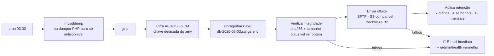

# 11 — Segurança, Autenticação, Backup e Privacidade

Contexto de ameaça realista: um sistema pessoal, exposto na internet, com **todos os dados financeiros
de uma pessoa**. Não há equipe de segurança nem WAF pago. A defesa tem de ser simples, correta e
verificável.

---

## 1. Autenticação (ADR-0009)

### 1.1 Decisões

| Item | Decisão | Motivo |
|------|---------|--------|
| Modelo | e-mail + senha + **TOTP** | sem dependência de terceiros, funciona em host compartilhado |
| Hash | **Argon2id** (`PASSWORD_ARGON2ID`, m=64MB, t=4, p=1) | resistente a GPU; fallback bcrypt cost 12 se indisponível |
| Sessão | **server-side** em tabela, cookie só com o hash do token | permite revogar de verdade, listar dispositivos, expirar |
| Cookie | `HttpOnly; Secure; SameSite=Lax; Path=/` + nome com prefixo `__Host-` | protege contra XSS e CSRF cross-site |
| Cadastro público | **não existe** | `bin/console user:create`. Vetor de ataque eliminado |
| Sessão | 30 dias com rotação de token a cada 24 h; "lembrar-me" separado | conveniência sem token eterno |
| Reset de senha | e-mail com token de uso único, 30 min, invalida todas as sessões | |
| 2FA | TOTP no V1; dispositivo confiável por 30 dias; 8 códigos de recuperação | senha vazada não basta |
| Futuro | Passkeys (WebAuthn) em V2 | melhor UX e melhor segurança |

**Por que não JWT:** o cliente é o próprio site. JWT adicionaria impossibilidade de revogação
imediata e risco de token em `localStorage` (acessível por XSS), sem nenhum ganho. Para integrações
(WhatsApp/API em V3) usaremos **API tokens em tabela própria**, com escopo, expiração e revogação individual.

### 1.2 Proteção contra força bruta

- `login_attempts` por e-mail **e** por IP.
- Backoff progressivo: 5 falhas → 1 min; 10 → 15 min; 20 → 1 h + e-mail de alerta.
- Resposta genérica sempre ("credenciais inválidas") — nunca revela se o e-mail existe.
- Tempo de resposta constante no caminho de falha (evita enumeração por timing).
- Rate limit global por IP em toda a API.

---

## 2. Superfície de ataque e defesas

| Vetor | Defesa |
|-------|--------|
| **SQL Injection** | 100% prepared statements com parâmetros nomeados. Zero concatenação de input. Nome de coluna em `ORDER BY` vem de allowlist, nunca do request |
| **XSS** | escape por padrão na renderização; JSON via `json_encode` com flags de escape; CSP sem `unsafe-inline`; nada de `innerHTML` com dado do usuário (só `textContent`) |
| **CSRF** | token por sessão, exigido em todo `POST/PATCH/DELETE`, validado por comparação time-safe; `SameSite=Lax` como segunda camada |
| **Clickjacking** | `X-Frame-Options: DENY` + `frame-ancestors 'none'` |
| **Path traversal** | anexos nunca acessados por caminho do request: só por `document_id` → autorização → `storage_path` do banco |
| **Upload malicioso** | validação de MIME **real** (finfo, não extensão), allowlist de tipos, limite de tamanho, nome gerado (ULID), fora do webroot, servido com `Content-Disposition: attachment` e `X-Content-Type-Options: nosniff` |
| **IDOR** | **todo** repositório filtra por `user_id`. Regra: nenhuma query de leitura sem `user_id` no WHERE — verificado em revisão e por teste |
| **Mass assignment** | DTOs explícitos por endpoint; nunca `$_POST` direto em entidade |
| **Enumeração de recursos** | IDs sequenciais protegidos por autorização; ULID em tokens e nomes de arquivo |
| **ReDoS** (regra do usuário) | validação do padrão + `preg_match` com limite de backtrack + timeout |
| **XXE / SSRF** | não parseamos XML externo; nenhuma requisição de saída com URL fornecida pelo usuário |
| **Exposição de arquivos** | só `public/` no webroot; `.htaccess` bloqueando `.env`, `.md`, `.sql`, `.log`; `Options -Indexes` |
| **Erros verbosos** | `display_errors=Off` em produção; erro genérico + `request_id` para o usuário; stack trace só no log |
| **Dependências** | mínimas e auditadas; `composer audit` no CI; atualização mensal |

### 2.1 Cabeçalhos HTTP (todos aplicados)

```
Content-Security-Policy: default-src 'self'; img-src 'self' data: blob:; script-src 'self';
  style-src 'self'; font-src 'self'; connect-src 'self'; media-src 'self' blob:;
  frame-ancestors 'none'; base-uri 'none'; form-action 'self'; object-src 'none'
Strict-Transport-Security: max-age=31536000; includeSubDomains
X-Content-Type-Options: nosniff
X-Frame-Options: DENY
Referrer-Policy: strict-origin-when-cross-origin
Permissions-Policy: geolocation=(), camera=(self), microphone=(self)
Cache-Control: no-store   (em respostas de API autenticadas)
```

CSP sem `unsafe-inline` é o que obriga o front a ser bem-feito (sem `onclick=` no HTML) — restrição
que melhora o código, não só a segurança.

---

## 3. Segredos e criptografia

| Segredo | Onde | Como |
|---------|------|------|
| Credenciais do banco | `.env` fora do webroot, `chmod 600` | nunca no Git |
| `APP_KEY` (32 bytes) | `.env` | base das cifragens simétricas |
| Chave da API de IA | `.env` | rotacionável; nunca em log |
| Senhas de PDF do usuário | banco, **cifradas** com `APP_KEY` (AES-256-GCM) | conveniência com risco contido |
| `totp_secret` | banco, cifrado | |
| Chave de backup | `.env` (separada de `APP_KEY`) | permite restaurar sem expor a app |
| Senha do usuário | Argon2id | irreversível |
| CPF/CNPJ de terceiros | **nunca completo**: máscara + hash | permite casar sem armazenar o dado |

`.gitignore` protege `.env`, `storage/`, `*.sql`, `*.dump`. Hook de pre-commit procurando padrões de
segredo. `composer audit` no CI.

---

## 4. Backup — a defesa mais importante

> **Backup que nunca foi restaurado não é backup.** A restauração é parte do procedimento, não um extra.

### 4.1 O que é protegido

| Ativo | Como | Frequência |
|-------|------|-----------|
| Banco (dados) | dump SQL comprimido e cifrado | diário 03:30 |
| `storage/uploads` (documentos originais) | tar incremental cifrado | diário (semanal completo) |
| `.env` + chaves | cópia manual, offline, fora do servidor | a cada mudança |
| Código | Git (remoto) | a cada commit |

### 4.2 Fluxo



- **Verificação de plausibilidade** é essencial: um dump de 2 KB "com sucesso" é o modo de falha
  clássico de backup. Se o tamanho cair >30% vs. o anterior, alerta.
- Offsite via `rclone` se disponível; caso contrário SFTP puro em PHP. Nunca só local — disco do host
  morre junto com o site.
- Downloads manuais: `GET /export/full.json` (dados) e botão de baixar o último dump — o PO nunca
  fica preso ao servidor.

### 4.3 Restauração (procedimento documentado e testado)

```bash
php bin/console backup:decrypt db-2026-08-03.sql.gz.enc > restore.sql
mysql -u user -p schema_de_teste < restore.sql
php bin/console backup:verify --schema=schema_de_teste   # confere contagens e invariantes
```

**Drill mensal obrigatório** (item do checklist de cada fase): restaurar em schema separado, rodar
`backup:verify`, registrar em `PROJECT.md`. RPO alvo: 24 h. RTO alvo: 1 h.

---

## 5. Auditoria

- `audit_log` **append-only**: nunca UPDATE, nunca DELETE. Registra usuário, ação, entidade,
  antes/depois em JSON, origem, IP, `request_id`, timestamp em milissegundos.
- Cobre tudo que o PO pediu: categoria alterada, valor corrigido, descrição alterada, recorrência
  criada, regra criada, anexo adicionado, movimentação excluída — e mais: merges, imports, rollbacks,
  login, troca de senha, mudanças de configuração.
- Exposto na UI por transação ("histórico de alterações") e globalmente em Configurações.
- Retenção: **indefinida** (é pequeno e é a memória do sistema).

---

## 6. Privacidade e LGPD

Mesmo sendo uso pessoal, o desenho respeita os princípios — e isso é o que permite virar multiusuário depois:

| Princípio | Implementação |
|-----------|---------------|
| Minimização | não guardamos CPF/CNPJ completo de terceiros; só máscara + hash |
| Finalidade | dado enviado à IA é o mínimo necessário; PII redigida antes |
| Transparência | tela de "uso de IA" mostrando o que foi enviado, para quê, quando e quanto custou |
| Portabilidade | `GET /export/full.json` — dump completo e legível a qualquer momento |
| Eliminação | `bin/console user:purge` remove dados e arquivos definitivamente |
| Segurança | tudo desta seção |
| Retenção | documentos e transações mantidos indefinidamente (decisão do titular); logs 30 dias; jobs concluídos 30 dias |

**Retenção zero de dados no provedor de IA** solicitada por configuração de conta — e a arquitetura
funciona sem IA se essa garantia não for possível.

---

## 7. Checklist de segurança por release

- [ ] `composer audit` sem vulnerabilidade conhecida
- [ ] PHPStan nível 8 sem erro
- [ ] Nenhuma query nova sem `user_id` no WHERE
- [ ] Nenhum `innerHTML` com dado do usuário
- [ ] Novo endpoint de mutação exige CSRF e autenticação
- [ ] Novo upload valida MIME real e grava fora do webroot
- [ ] `.env` não versionado; nenhum segredo em log
- [ ] Cabeçalhos de segurança presentes em produção (verificado por request real)
- [ ] Backup do dia gerado, íntegro e enviado offsite
- [ ] Drill de restauração do mês registrado
