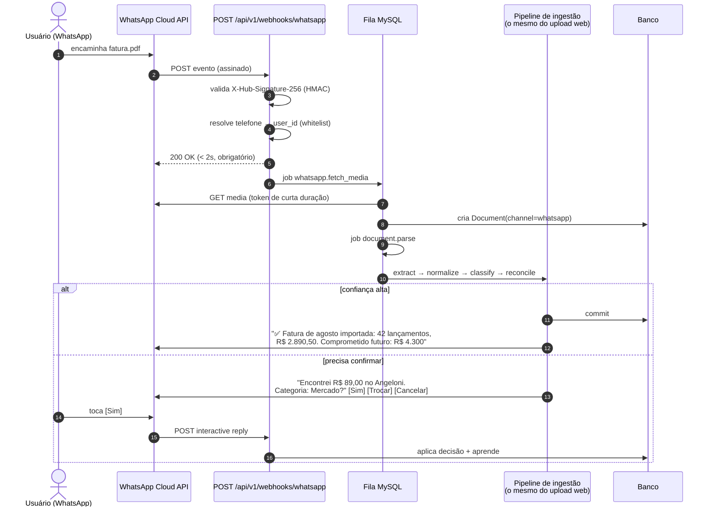

# 12 — Estratégia de Crescimento e Arquitetura do WhatsApp

## 1. Como o sistema cresce sem ser reescrito

Quatro eixos de crescimento, cada um com caminho já preparado:

```mermaid
graph TB
  subgraph "Eixo 1 — Canais de entrada"
    A1[web upload] --> A2[texto/voz] --> A3[WhatsApp] --> A4[e-mail] --> A5[Open Finance?]
  end
  subgraph "Eixo 2 — Volume de dados"
    B1[1 ano] --> B2[5 anos] --> B3[10 anos]
  end
  subgraph "Eixo 3 — Usuários"
    C1[1 usuário] --> C2[família] --> C3[multi-tenant real]
  end
  subgraph "Eixo 4 — Infra"
    D1[host compartilhado] --> D2[VPS pequeno] --> D3[VPS + fila real]
  end
```

### Eixo 1 — Canais: custo marginal quase zero
`IngestionChannel` é uma interface. Novo canal implementa "recebe payload → cria `Document` → enfileira".
Extração, classificação, conciliação e commit são **os mesmos**. Adicionar WhatsApp em V3 não toca em
uma linha de domínio (ADR-0017). Foi para isso que o pipeline de 8 etapas foi desenhado antes de
qualquer canal existir.

### Eixo 2 — Volume: já dimensionado
Estimativa realista: ~300 transações/mês → **36 mil em 10 anos**. Isso é irrelevante para o MySQL
com os índices desenhados. Os pontos de atenção reais e suas respostas:

| Pressão | Resposta |
|---------|----------|
| Dashboards agregando 10 anos | read models materializados (`cashflow_snapshots`, `category_month_rollup`) |
| `documents` (PDFs/imagens) crescendo em disco | ~2 GB em 10 anos; política de arquivamento para offsite se apertar |
| `audit_log` crescendo | pequeno; particionamento por ano só se passar de milhões |
| `jobs` acumulando | limpeza automática de concluídos > 30 dias |
| Listagens longas | paginação por cursor desde o dia 1 (offset degrada, cursor não) |

Nada aqui exige mudança de arquitetura. Foi decidido na modelagem, não deixado para depois.

### Eixo 3 — Usuários: já multi-tenant
`user_id` está em toda tabela desde a primeira migração (ADR-0008). Virar familiar/multiusuário exige:
convites, papéis (dono/membro/leitor), escopo de compartilhamento por conta e visão consolidada.
**Nenhuma migração de dados.** É a diferença entre uma feature de 2 semanas e uma reescrita de 3 meses.

### Eixo 4 — Infra: caminho de saída conhecido

| Gatilho | Ação | Esforço |
|---------|------|---------|
| Cron insuficiente / jobs acumulando | VPS pequeno (~US$ 5/mês) com worker `supervisord` chamando o **mesmo** `queue:work` | 1 dia |
| Fila MySQL sob pressão | trocar `MysqlQueue` por `RedisQueue` (mesma interface) | 1 dia |
| Dashboards lentos | mais read models / cache de resposta | dias |
| Storage insuficiente | `FileStorage` → `S3FileStorage` (mesma interface) | 1 dia |
| Precisar de outro banco | repositórios PDO com SQL explícito e portátil | semanas |

**Nenhum desses gatilhos exige reescrever domínio.** É exatamente o retorno do investimento em
E1/E2 (`PROJECT.md`).

---

## 2. Arquitetura do WhatsApp (V3, projetada agora)

### 2.1 Objetivo do PO

> Encaminhar PDF, imagem, áudio ou mensagem para um número de WhatsApp e tudo entra automaticamente.

### 2.2 Como se encaixa (a resposta curta: como um canal, não como um módulo)

### 2.3 O que precisa ser escrito (e o que não)

| Componente | Novo? |
|------------|-------|
| `Http/Controller/Webhook/WhatsAppController` (verify + receive) | ✅ novo, ~150 linhas |
| `Infrastructure/WhatsApp/CloudApiClient` (download de mídia, envio de mensagem/botões) | ✅ novo |
| `Infrastructure/Ingestion/Channel/WhatsAppChannel` (implementa `IngestionChannel`) | ✅ novo, ~80 linhas |
| Tabela `whatsapp_contacts` (phone_hash → user_id, status, opt-in) | ✅ nova, 1 migração |
| Tabela `whatsapp_messages` (idempotência por `wamid`, log de conversa) | ✅ nova |
| Extração de PDF / visão / transcrição / NLU | ♻️ **reuso total** |
| Classificação, conciliação, parcelas, recorrências, projeção | ♻️ **reuso total** |
| Modelo de dados de transações | ♻️ **zero mudança** |

**~2 semanas de trabalho para um canal completamente novo.** É esse o retorno concreto de ter
desenhado o pipeline como pipeline.

### 2.4 Decisões técnicas do canal

| Assunto | Decisão |
|---------|---------|
| Provedor | **WhatsApp Cloud API** (Meta) direto — sem intermediário pago. 1.000 conversas de serviço/mês gratuitas cobrem uso pessoal com folga |
| Segurança | HMAC `X-Hub-Signature-256` obrigatório; **whitelist de números**; qualquer número desconhecido é ignorado silenciosamente (não responder é a defesa) |
| Idempotência | `wamid` UNIQUE em `whatsapp_messages` — Meta reenvia webhooks; sem isso, duplicata garantida |
| Latência | webhook responde em < 2 s **sempre** (só valida e enfileira); processamento é assíncrono |
| Janela de 24 h | respostas proativas fora da janela exigem template aprovado; alertas usam template, confirmações usam a janela |
| Mídia | baixada no job com token de curta duração; guardada como `Document`; **nunca** processada no request do webhook |
| Confirmações | mensagens interativas com botões (`Sim` / `Trocar categoria` / `Cancelar`) |
| Consultas | comandos simples: `saldo`, `gastos mês`, `fatura`, `parcelas`, `quanto gastei com mercado` |
| Falhas | erro → mensagem clara ao usuário + item na fila de Revisão do webapp; nunca silêncio |

### 2.5 Riscos específicos do canal

| Risco | Mitigação |
|-------|-----------|
| Número clonado/spoofado envia lançamentos falsos | whitelist + confirmação para valores acima de um limite configurável |
| Meta muda a API (histórico de mudanças frequentes) | canal isolado atrás de interface; o resto do sistema não sabe que WhatsApp existe |
| Webhook exige HTTPS público estável | já é requisito do próprio webapp |
| Custo de conversa se o volume subir | contador em `/admin/health` com teto e alerta |
| Mensagem ambígua gera lançamento errado | mesma regra de confiança do resto: abaixo do limiar, pergunta com botões |

---

## 3. Sinais de que é hora de mudar de patamar

Monitorados em `/admin/health`, com gatilho explícito — para a decisão ser tomada por dado, não por sensação:

| Métrica | Limite | Ação |
|---------|--------|------|
| Job mais antigo na fila | > 10 min de forma recorrente | VPS com worker permanente |
| Tempo do dashboard | > 800 ms (p95) | mais read models / cache |
| Custo mensal de IA | > US$ 10 | revisar cascata e limiares |
| Taxa de auto-classificação | < 90% após 3 meses | mais regras semente / mais LLM |
| Erro de projeção | > 15% por 2 meses seguidos | revisar `VariableSpendEstimator` |
| Transações em revisão | > 30 acumuladas | revisar limiares de confiança |
| Uso de disco de uploads | > 80% da cota | arquivar documentos antigos offsite |

---

## 4. O que garante que este projeto viva 10 anos

1. **Domínio isolado** — a regra de "quando a parcela cai na fatura" está em uma classe testada, não
   espalhada em controllers. Isso é o que permite trocar tudo em volta.
2. **Dados brutos preservados** — `documents.extracted_text`, `raw_description`, evidências. O sistema
   pode ficar mais inteligente **retroativamente**, sobre 10 anos de histórico.
3. **Nada externo é obrigatório** — sem IA, sem WhatsApp, sem provedor de transcrição, o sistema
   continua completo. Cada integração é um bônus removível.
4. **Memória escrita** — `PROJECT.md` + ADRs + glossário. Retomar depois de 6 meses de pausa é ler
   dois arquivos, não arqueologia de código.
5. **Invariantes como testes** — as 10 regras que não podem quebrar quebram o build antes de quebrar
   os dados.
6. **Custo próximo de zero** — nada que crie pressão para desligar o projeto.
7. **Saída sempre disponível** — exportação completa em 1 clique. O sistema não aprisiona os dados,
   o que significa que ele é mantido por vontade, não por dependência.
